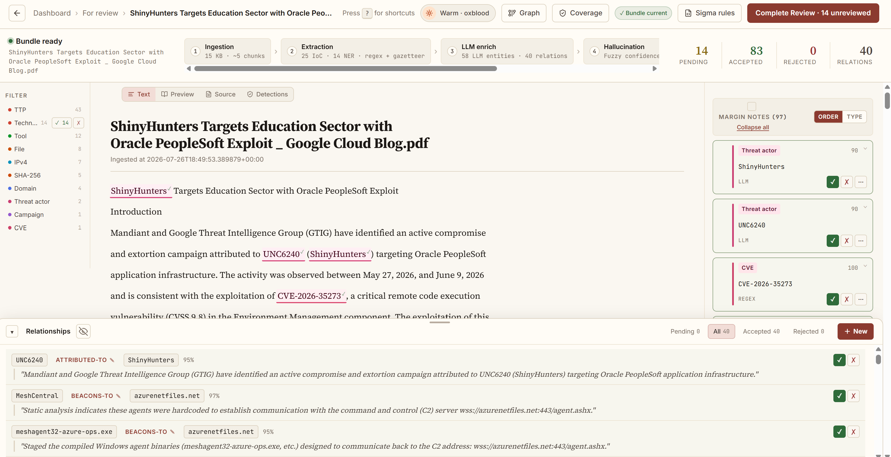
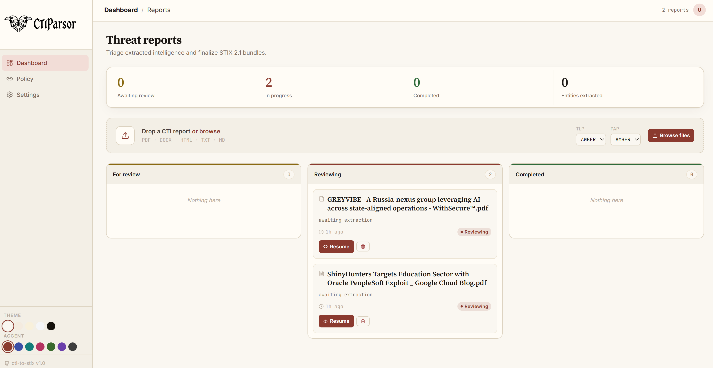
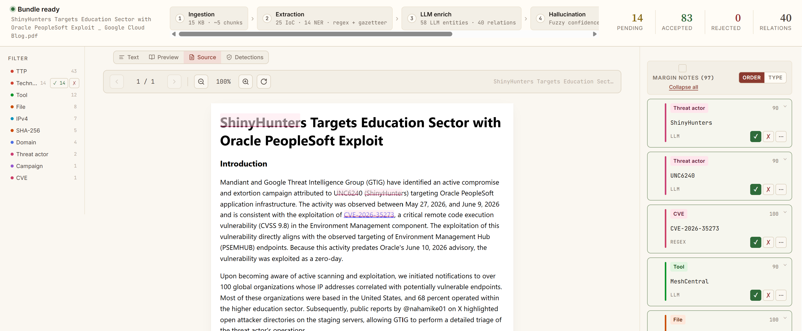
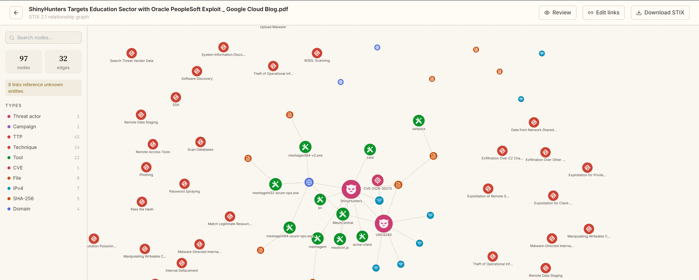
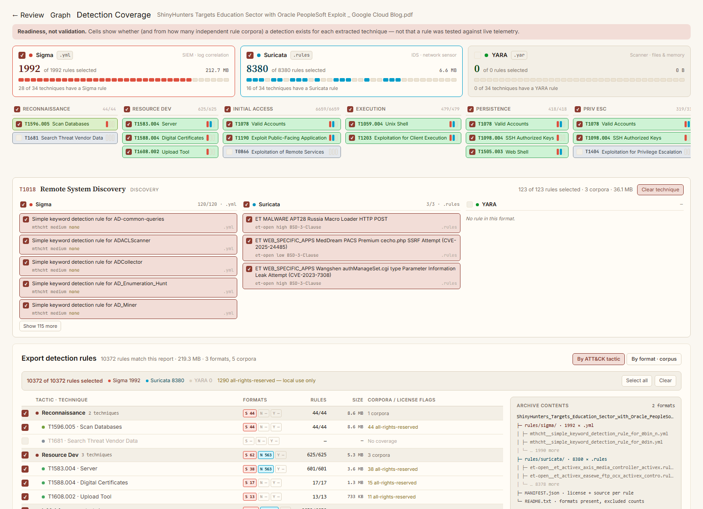
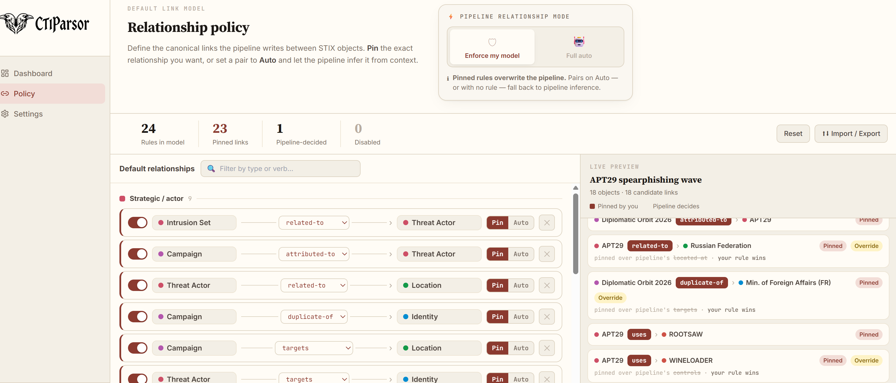
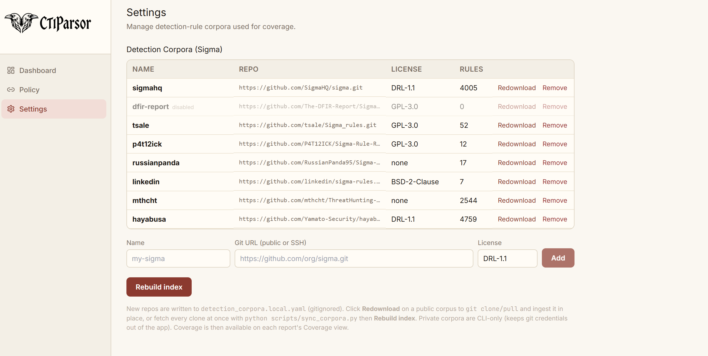

# CTIParsor

Converts unstructured CTI reports (PDF, DOCX, HTML, TXT, MD) into valid **STIX 2.1 bundles** consumable by OpenCTI, MISP, and SIEMs.

The pipeline combines **deterministic IoC extraction** (regex + multi-layer NER) with **LLM semantic enrichment** (TTPs, relationships, malware attribution), a **post-LLM hallucination filter**, **self-verification of relationship *and* TTP claims**, optional **cross-model consensus**, NATO-style **evidence grading** of every relationship, and **offline MITRE ATT&CK normalisation** with model-aware semantic TTP precision controls (ADR-0011). Every bundle carries **STIX provenance markings** — a TLP (and optional PAP) marking plus an authoring identity (`created_by_ref`). The LLM stage is optional — the pipeline produces valid STIX even without an API key.

It also maps each report's ATT&CK techniques to a **detection-coverage matrix** against local **Sigma, Suricata and YARA** rule corpora (public and private), then lets you select rules per technique, tactic, corpus or format and export exactly those — all managed from an in-app **Settings** panel.

Two modes are available:

- **CLI** — `python main.py report.pdf` — for scripting and batch processing
- **Web UI** — React + FastAPI — for interactive review, relationship editing, STIX graph visualisation (official OASIS icons), the **detection-coverage matrix**, and **corpus settings**

---

## Screenshots

<p align="center">
  
  <br><em>Review workspace — entity annotation, marginalia, and evidence-graded relationship review</em>
</p>

| | |
|:---:|:---:|
| <br>**Dashboard** — drag-and-drop upload + kanban | <br>**Source view** — inline original file (PDF / HTML / TXT / MD) |
| <br>**STIX graph** — relationships with official OASIS icons | <br>**Detection coverage** — per-format readiness + granular rule selection |
| <br>**Relationship policy** — canonical STIX links, pin / auto | <br>**Settings** — Sigma corpus management |

---

## Quick start — CLI

```bash
# 1. Clone and enter the project
git clone <repo-url> && cd CTIParsor

# 2. Full setup (venv, Python deps, MITRE data, Node build)
bash setup.sh

# 3. Activate the venv
source .venv/bin/activate

# 4. Add your LLM API key
cp .env.example .env
nano .env   # set ANTHROPIC_API_KEY=sk-ant-...

# 5. Process a report
python main.py input/your_report.pdf
# → output/your_report_bundle.json
```

Supported input formats: `.pdf` `.docx` `.html` `.htm` `.txt` `.md`

---

## Quick start — Web UI

```bash
# After completing CLI quick start:

# Start the server (API + pre-built frontend on one port)
python run_api.py
# → http://localhost:8000
```

> **To let other machines reach it**, set `API_HOST=0.0.0.0` in `.env` and
> restart. Read [docs/deployment.md](docs/deployment.md) first: there is no
> authentication, so everyone who can reach the port shares one workspace.
> Running `uvicorn` directly ignores `.env` and always binds to loopback.

> **Do not run the server as root.** URL ingestion (ADR-0029) renders the page in
> a sandboxed Chromium, and Chromium refuses to run as root with its sandbox on —
> so `/api/ingest/url` answers 503 there. The sandbox is what keeps a renderer
> exploit on a hostile page from becoming code execution on the host, so the fix
> is to drop root, not to disable it. If you are in a `sudo su` shell, `exit`
> first.
>
> A container that genuinely cannot grant unprivileged user namespaces can set
> `CTIPARSOR_CAPTURE_UNSANDBOXED=1`, which renders without the sandbox and logs a
> warning naming the risk on every capture. Nothing else in the pipeline needs
> root.

> **Development mode** (live reload on both sides):
> ```bash
> # Terminal 1 — FastAPI backend
> API_RELOAD=1 python run_api.py
>
> # Terminal 2 — Vite frontend with HMR
> cd frontend && npm run dev
> # UI → http://localhost:5173
> ```

---

## Pipeline

```
┌──────────────────────────────────────────────────────────────────────┐
│  Stage 1 — INGESTION                                    (offline ✅)  │
│  PDF / DOCX / HTML / TXT / MD → normalised text + chunks            │
│  • Text PDF    : markitdown (structure-preserving) → pdfplumber      │
│  • Scanned PDF : auto-detected → OCR via Tesseract / pdf2image       │
│  • Defanging   : hxxps://, [.], (.), [at], [@] → live form          │
│  • Chunking    : paragraph-aware + 400-char sliding-window overlap   │
│  • Adaptive    : larger chunks for large docs (3 000–5 000 chars)    │
└─────────────────────────────┬────────────────────────────────────────┘
                              │
┌─────────────────────────────▼────────────────────────────────────────┐
│  Stage 1f — FIGURE READING                       (opt-in — ADR-0032) │
│  PDF-only · off by default (VISION_PROVIDER=none)                    │
│  • Triage    : geometry discards 56.9% of images before any model    │
│  • Crops     : 150 DPI crops, not pages (977 tokens vs 2 191/page)   │
│  • Injection : transcription enters report_text in ⟦…⟧ sentinels     │
│  • Relations : attack-chain / network-diagram arrows → src -> dst    │
│  • Safety    : an unreadable figure is skipped, never costs the run  │
│  Enable: VISION_PROVIDER=anthropic|ollama|mistral in .env            │
└─────────────────────────────┬────────────────────────────────────────┘
                              │
┌─────────────────────────────▼────────────────────────────────────────┐
│  Stage 2 — REGEX IOC EXTRACTION                         (offline ✅)  │
│  IPv4/v6, domains, URLs, emails, MAC, ASN, file paths + filenames   │
│  Registry keys, MD5/SHA-1/SHA-256 (incl. line-wrapped hashes)        │
│  CVE IDs, raw MITRE ATT&CK IDs (T1234 / T1234.001) → ttp            │
└─────────────────────────────┬────────────────────────────────────────┘
                              │
┌─────────────────────────────▼────────────────────────────────────────┐
│  Stage 2b — GAZETTEER NER                               (offline ✅)  │
│  Aho-Corasick scan over 1 827 name variants (1 114 unique malware   │
│  families, offensive tools and APT groups — ATT&CK Ent + Mob + ICS) │
│  • Longest-match-wins, word-boundary checked                        │
│  • Confidence: 0.92 canonical / 0.88 alias                          │
└─────────────────────────────┬────────────────────────────────────────┘
                              │
┌─────────────────────────────▼────────────────────────────────────────┐
│  Stage 2c — SEMANTIC TTP DETECTION                      (offline ✅)  │
│  Sentence-transformer cosine-similarity against the pre-embedded    │
│  MITRE technique descriptions (local .npy cache)                    │
│  • Default model: all-MiniLM-L6-v2 (80 MB)                         │
│  • Upgrade: ehsanaghaei/SecureBERT-Plus (+8-12% F1 on CTI text)     │
│  • Model-aware tiers: ≥ high wins over LLM / medium = candidate     │
│    (MiniLM 0.62 / 0.48; resolved per-model — ADR-0011 Phase A)      │
│  • 1 match/sentence (top_k=1); TTP_TOP2_MARGIN guards any 2nd match  │
│  • ATT&CK-only by default (918 of 1 533): CAPEC shadows the real    │
│    technique, so it is excluded — TTP_SEMANTIC_DOMAINS=all restores │
└─────────────────────────────┬────────────────────────────────────────┘
                              │
┌─────────────────────────────▼────────────────────────────────────────┐
│  Stage 2d — CyNER 2.0                       (offline once cached)   │
│  DeBERTa-v3 fine-tuned on cybersecurity NER (F1 91.88%)             │
│  Detects: Malware, Threat_group (threat-actor groups)               │
│  Model: PranavaKailash/CyNER-2.0-DeBERTa-v3-base (CYNER_ENABLED)    │
└─────────────────────────────┬────────────────────────────────────────┘
                              │
┌─────────────────────────────▼────────────────────────────────────────┐
│  Stage 2e — GLiNER ZERO-SHOT NER                       (offline ✅)  │
│  Zero-shot NER with natural-language label descriptions              │
│  Detects entity types the gazetteer and CyNER cannot:               │
│    targeted sectors, campaign names, attack infrastructure,          │
│    novel actors & malware not yet in MITRE ATT&CK                   │
│  Default model: urchade/gliner_large-v2.1 (~800 MB)                 │
│  Configurable via GLINER_MODEL in .env                              │
└─────────────────────────────┬────────────────────────────────────────┘
                              │
┌─────────────────────────────▼────────────────────────────────────────┐
│  Stage 3 — LLM ENRICHMENT              (requires API key)            │
│  Input : chunk + pre-detected IoCs + gazetteer/NER context          │
│  Output: threat actors, malware families, tools, TTPs,              │
│          relationships (+ evidence quote), IoC→malware links,       │
│          targeted sectors/countries, course of action               │
│  • Parallel processing (configurable via LLM_PARALLELISM)           │
│  • Crash-resume: checkpoint saved every N chunks                     │
│  • Providers: Anthropic Claude | Mistral AI | Ollama                │
└─────────────────────────────┬────────────────────────────────────────┘
                              │
┌─────────────────────────────▼────────────────────────────────────────┐
│  Stage 3b — HALLUCINATION FILTER                        (offline ✅)  │
│  Verifies each LLM-returned name against source chunk text           │
│  via fuzzy sliding-window matching (rapidfuzz):                     │
│  • ≤ 5 chars (FIN7, APT1)   : 92% similarity threshold             │
│  • 6–9 chars (LummaC2)      : 80% similarity threshold             │
│  • ≥ 10 chars (Cobalt Strike): 75% similarity threshold            │
│  Campaign names: word-level fallback to avoid over-filtering        │
│  Names already confirmed by NER or doc context skip the fuzzy scan   │
└─────────────────────────────┬────────────────────────────────────────┘
                              │
┌─────────────────────────────▼────────────────────────────────────────┐
│  Stage 3d — RELATIONSHIP SELF-VERIFICATION              (optional)   │
│  Second LLM call: "quote the exact sentence supporting this claim"  │
│  Unsupported relationships are removed.                             │
│  Effect: hallucination rate 27% → 8% (aCTIon paper, NEC Labs 2023) │
│  Cost: ~1.4× total LLM calls (only chunks with ≥ 1 relationship)   │
│  Enable: ENABLE_STIX_VERIFICATION=true in .env                      │
└─────────────────────────────┬────────────────────────────────────────┘
                              │
┌─────────────────────────────▼────────────────────────────────────────┐
│  Stage 3f — TTP SELF-VERIFICATION                       (optional)   │
│  TTP analogue of 3d: second LLM call quotes the sentence describing │
│  each technique's USE (with its expected ATT&CK tactic); unsupported │
│  techniques are dropped. Semantic-corroborated TTPs are trusted and │
│  skipped, so cost tracks 3d (~1.4× calls — ADR-0011 Phase B).       │
│  Enable: ENABLE_TTP_VERIFICATION=true in .env                       │
└─────────────────────────────┬────────────────────────────────────────┘
                              │
┌─────────────────────────────▼────────────────────────────────────────┐
│  Stage 3e — CROSS-MODEL CONSENSUS                       (optional)   │
│  Re-runs every relationship-bearing chunk through a SECOND provider  │
│  and treats agreement as a trust signal — a model is a poor judge of │
│  its own hallucination; two different models disagreeing is signal.  │
│  • Agreed by both   : confidence +0.10                               │
│  • Primary only     : confidence −0.20, "observed" → "reported"      │
│  Enable: ENABLE_CONSENSUS=true + CONSENSUS_PROVIDER (≠ LLM_PROVIDER) │
└─────────────────────────────┬────────────────────────────────────────┘
                              │
┌─────────────────────────────▼────────────────────────────────────────┐
│  Stage 3c — MITRE ATT&CK NORMALISATION                 (offline ✅)  │
│  Runs ONCE per document, after every chunk is merged — not per chunk │
│  Fuzzy-matches extracted TTPs against the full ATT&CK corpus         │
│  (Enterprise + Mobile + ICS + CAPEC, compact local JSON index)       │
│  • Score ≥ 85 : canonical name + correct MITRE ID                    │
│  • Score 70–84: keep LLM phrasing, override ID                       │
│  • Score < 70 : pass through unchanged                               │
│  + Merge precision (ADR-0011): only HIGH-confidence semantic wins    │
│    over the LLM; parent technique dropped when a sub-technique fires │
└─────────────────────────────┬────────────────────────────────────────┘
                              │
┌─────────────────────────────▼────────────────────────────────────────┐
│  Stage 4 — STIX 2.1 MAPPING                            (offline ✅)  │
│  IoC → SCO  (IPv4Address, DomainName, File, URL, Email, MACAddr…)  │
│  Malware / Actor / Tool / TTP / CVE / Campaign / Infra → SDO        │
│  Location → SDO (targeted country, ISO 3166-1 lookup, 80+ nations)  │
│  Identity → SDO (targeted sector, identity_class=class)             │
│  CourseOfAction → SDO (recommended remediations)                    │
│  All accepted IoCs → Indicator → based-on → ObservedData → SCO       │
│  IoC linked to malware → indicates SRO                              │
│  Threat actor → targets → Location / Identity SROs                 │
│  Semantic relations → Relationship SRO (deduplicated, spec-valid)    │
│  Every object: TLP/PAP marking + created_by_ref → authoring Identity │
└─────────────────────────────┬────────────────────────────────────────┘
                              │
┌─────────────────────────────▼────────────────────────────────────────┐
│  Stage 4b — GRAPH COMPLETION                (offline ✅ — ADR-0013)   │
│  Enriches edges AFTER the precision gate, never loosening it.        │
│  Runs before the Report SDO, so new edges are wrapped + stamped.     │
│  1. Alias merge     : OFF by default — aliases.py (ADR-0012) already │
│    (fallback)         canonicalises MITRE aliases at SDO creation.   │
│                       Fallback for non-gazetteer names only.         │
│  1b. ATT&CK grounding: add MITRE-curated edges (20 015 G/S/T pairs)  │
│                       when both endpoints resolve to ATT&CK IDs      │
│                       → x_evidence_label="reported" (expert fact)    │
│  2. Transitive infer : compose two verified edges via a fixed table  │
│                       (uses∘uses→uses …); a composed verb that is    │
│                       not spec-*suggested* is SKIPPED, not emitted   │
│  Every inferred edge: x_evidence_label="inferred" + x_inference_rule │
│  + x_inferred_from (premise ids). Pinned policy rules always win.    │
└─────────────────────────────┬────────────────────────────────────────┘
                              │
┌─────────────────────────────▼────────────────────────────────────────┐
│  Stage 4c — LONG-DISTANCE PREDICTION                    (optional)   │
│  Connects still-disconnected sub-graphs (CTINexus Phase 3):          │
│  DFS components → central node per component (degree centrality) →   │
│  topic node (global max degree) → ask the LLM for the relation.      │
│  Same evidence bar as 3d: the model must QUOTE the supporting        │
│  sentence (stored as x_evidence_text) — no quote ⟹ no edge.          │
│  Off unless policy completion.long_distance=true AND provider ready  │
│  (so Stage 4 stays network-free by default).                         │
└─────────────────────────────┬────────────────────────────────────────┘
                              │
┌─────────────────────────────▼────────────────────────────────────────┐
│  Stage 5 — VALIDATION & EXPORT                         (offline ✅)  │
│  stix2 library validates every object at construction time           │
│  stix2-validator JSON-schema check (when schemas installed)          │
│  Valid bundle → output/{report}_bundle.json                         │
│  Invalid bundle → output/{report}_bundle_invalid.json (for debug)   │
└──────────────────────────────────────────────────────────────────────┘

On Finalize (web UI):
  + Report Lexicon Re-scan: accepted named entities used as a per-report
    domain lexicon to find additional occurrences missed by NER/LLM.
    Source tagged "report_lexicon". Zero ML cost, pure string matching.
```

**This diagram describes the web/API path** (`api/worker.py`), which is the full
pipeline. The `python main.py` CLI is a thinner subset — it runs Stage 2 regex
extraction only (no gazetteer, semantic TTP, CyNER or GLiNER), uses a fixed
3 000-char chunk size instead of the adaptive one, and has no consensus or
lexicon re-scan. Use the web UI, or `make api`, to exercise every stage.

Stage order note: 3b, 3d, 3f and 3e run **per chunk**; 3c runs **once per
document**, after every chunk has been merged. The boxes are drawn in that
execution order.

---

## Usage

### CLI — single file
```bash
python main.py input/report.pdf
python main.py input/report.pdf --output output/apt29.json
```

### CLI — batch folder
```bash
python main.py --input-dir input/
python main.py --input-dir input/ --output-dir output/
```

### Run tests
```bash
pytest tests/ -v               # all tests
pytest tests/ -v -k "not llm"  # skip LLM tests (no key needed)
```

### Measure extraction quality (offline)

Three benchmarks live in `tests/eval_pipeline.py` — recall (`ner`, `ate`) and a
**hallucination-rate** benchmark (`grounding`) that scores how much emitted output
is *not* supported by the source text (ADR-0012). It reuses the pipeline's own
grounding primitive, runs fully offline, and can score reports you have already
processed straight from `cti_stix.db`:

```bash
# Hallucination rate on your real processed reports, segmented + alias/technique-aware
python tests/eval_pipeline.py -b grounding --from-db all \
    --rel-window 1 --alias-aware --rel-proximity 200

# ATT&CK Technique Extraction recall vs the GPT-4 baseline
python tests/eval_pipeline.py -b ate --stage all
```

Relationships are reported in two segments — **named-entity** vs **IoC/technical**
— because a single global number blends two very different regimes. Use this to
validate any extraction change before/after.

### make shortcuts

A `Makefile` wraps the most common workflows. Requires `make` (standard on Linux/macOS/WSL).

| Command | Description |
|---|---|
| `make setup` | Full first-time setup (runs `setup.sh`) |
| `make install` | Install / update Python packages only |
| `make install-api` | Install / update API packages only (`requirements-api.txt`) |
| `make install-capture` | Install Playwright + Chromium for URL capture (ADR-0029) |
| `make download-mitre` | Download MITRE bundle files only (no index build) |
| `make mitre` | Download MITRE bundle files + build all indexes |
| `make build-indexes` | Build indexes from already-downloaded bundle files |
| `make model` | Download spaCy `en_core_web_sm` model |
| `make frontend-install` | `npm ci` only (no build) |
| `make frontend-build` | Build frontend static assets only |
| `make test` | Run all tests |
| `make test-fast` | Run tests without LLM calls (no API key needed) |
| `make run` | Run pipeline on `tests/fixtures/sample_report.txt` |
| `make run-dir` | Run pipeline on every file in `input/` |
| `make api` | Build frontend, then start API (production) |
| `make api-dev` | Start API with hot-reload (dev backend) |
| `make frontend-dev` | Start Vite dev server with HMR (dev frontend) |
| `make check` | Diagnostic: list which pipeline stages are available |
| `make check-docs` | Verify every number claimed in this README against the source of truth |
| `make corpora` | Clone/pull the rule corpora (Sigma, Suricata, YARA) |
| `make detection-index` | Parse the clones into the rule store (dedups, writes rule sizes) |
| `make backfill-rules` | Backfill rule body sizes on a store built before ADR-0022 |
| `make audit` | Scan Python + npm deps for known CVEs (`pip-audit` + `npm audit`) |
| `make lock` | Freeze exact installed versions → `requirements.lock.txt` |
| `make update-deps` | Upgrade Python packages, run tests, re-lock |
| `make npm-outdated` | Show which npm packages have newer versions available |
| `make npm-update` | Upgrade npm packages within semver ranges, verify TypeScript |
| `make clean` | Remove generated bundle JSONs and `__pycache__` |
| `make clean-venv` | Remove `.venv` for a full reinstall |

---

## Web UI

### Workflow

```
Ingest — one of three (ADR-0029)
  │   File   drag-and-drop or file picker (PDF/DOCX/HTML/TXT/MD, 50 MB)
  │   Paste  plain text, Markdown, or HTML source — markup is stripped
  │   URL    headless Chromium renders the page server-side; the PDF is
  │          archived for review, its DOM text is what gets ingested
  │
  ▼
Processing  ─── Real-time 5-stage progress bar (SSE)
  │               Stage 1: Ingestion   → chars + chunks
  │               Stage 2: Extraction  → IoCs + NER counts
  │               Stage 3: LLM         → chunk N/total (live)
  │               Stage 4: STIX mapping (+ 4b graph completion)
  │               Stage 5: Validation
  ▼
For Review  ──►  Reviewing  ──►  Completed
  (Kanban)       (Review page)   (Graph + Download)
```

### Review page

Four view modes toggled at the top of the document pane:

| Mode | Content |
|---|---|
| **Text** | Annotated source text — entity occurrences highlighted by type, click to focus in marginalia, keyboard shortcuts |
| **Preview** | Rendered markdown — VS Code-like typography (headings, tables, code blocks, task lists). Works on all file types; most useful for `.md` reports |
| **Source** | The original file, rendered inline for every supported format: **PDF** (pdf.js pages), **HTML/HTM** (sandboxed iframe), **TXT/MD** (raw source). PDF and TXT/MD carry the same entity highlights as the Text view and support click-to-locate; **DOCX** falls back to a download link (no browser-native rendering) |
| **Detections** | Sigma rules **ranked by this report's own technical content** — hashes, domains, binaries, paths, registry keys, CVEs — and by platform, each with the evidence behind its rank (ADR-0014) |

**Entity interaction:**
- Entities highlighted inline with type-colour coding
- Click a mark in the text → scroll + focus in the marginalia panel
- Click a card in the marginalia → scroll + highlight in the text
- Entities not found verbatim in text (e.g. LLM-paraphrased campaign names) → brief "not found" hint displayed

**Keyboard shortcuts:**

| Key | Action |
|---|---|
| `J` / `↓` | Next pending entity |
| `K` / `↑` | Previous pending entity |
| `A` | Accept focused entity |
| `R` | Reject focused entity |
| `U` | Reset to pending |
| `G` | Open STIX graph |
| `F` | Finalize bundle |
| `?` | Show shortcut help |

**Entity states:**
- **Pending** (default) — included in bundle
- **Accepted** ✓ — explicitly confirmed, included
- **Rejected** ✗ — excluded from bundle

**Auto-accept:** Entities with confidence ≥ 90% are auto-accepted on load. A banner shows the count with an Undo option.

**Drag-to-relate:** Drag from one entity mark to another → opens relationship creator pre-filled with source and target.

**Shift-click:** Shift-click two entity marks → opens relationship creator.

**Text selection:** Select text spanning two entities → opens relationship creator with the selected text as evidence.

### Graph page

Custom **d3-force SVG graph** (not the OASIS stix-visualization iframe):

| Feature | Details |
|---|---|
| **Node icons** | Official OASIS STIX 2.1 icons (White/normal/SVG) for all SDO types; lucide-react stroke paths for SCO types (IPv4, Domain, URL, …) |
| **Layout modes** | Force (physics simulation) · Hierarchical (tier-based) · Radial (BFS from root) |
| **Type legend** | Click to toggle visibility · Double-click to solo a type |
| **Node search** | Search by name or type, jump-animate to result |
| **Relationship editor** | Accept / Reject / Reset / Delete relationships in the side panel; Add new relationships with evidence text |
| **Labels** | Toggle all labels; strategic nodes (tier 0–1) always show labels |
| **Fit button** | Animate to fit all nodes in viewport |
| **Download** | Download STIX bundle directly from the graph page |

### Policy page

Reached from the **Policy** entry in the sidebar (`/policy`) — a global setting,
not a per-report one. It edits the relationship policy the pipeline applies at
Stage 4: which `source → verb → target` triples are **pinned** (the analyst
states the link, and the pin always wins over anything inference produces) and
which are left on **auto**.

- **Enforce my model / Full auto** — the `global` switch. On auto the rule list
  is ignored entirely.
- **Pinned links** — the rule table: add, filter by type or verb, enable or
  disable each triple.
- **Pin budget** — how `max_pinned_edges` is split between rules
  (`fair-share` by default, `sequential` for the legacy behaviour).
- **Evidence gate** — the `pin_evidence` window: how many sentences apart two
  objects may be and still be pinned together.
- **Completion** — the Stage 4b toggles (`alias`, `reference`, `transitive`,
  `long_distance`, `fuzzy_alias`, `semantic_alias`, `max_new_edges`).

Every field maps onto the payload documented under
[Relationship policy](#relationship-policy); the page is a typed editor over it,
and the last run's per-rule accounting is read back from
`/api/relationship-policy/last-run`.

### Coverage page

Per-report **detection-coverage matrix** (`/coverage/:jobId`). The report's
extracted ATT&CK techniques are laid out in ATT&CK-tactic columns and coloured by
a **readiness score** (not lab validation):

| Score | Meaning |
|---|---|
| 3 — Corroborated | a rule exists in **≥ 2** corpora |
| 2 — Covered | a rule exists in **1** corpus |
| 1 — Telemetry only | ATT&CK data-source mapping, no rule yet |
| 0 — No coverage | technique extracted, no rule |

Cells show the technique, rule count, and contributing corpora. A banner makes
the "readiness ≠ validation" distinction explicit.

### Settings page

Manage **detection-rule corpora** (`/settings`): list configured Sigma repos with
live rule counts, add a repo (written to the gitignored local overlay), remove /
disable one, and **Rebuild index** to re-ingest the local clones. See
[Detection coverage](#detection-coverage-sigma).

---

## STIX objects produced

| Source | STIX object |
|---|---|
| IPv4 / IPv6 | `ipv4-addr` / `ipv6-addr` SCO |
| Domain | `domain-name` SCO |
| URL | `url` SCO |
| Email | `email-addr` SCO |
| File hash (MD5 / SHA-1 / SHA-256) | `file` SCO |
| MAC address | `mac-addr` SCO |
| ASN | `autonomous-system` SCO |
| File path (Windows/Unix) + bare filename | `file` SCO |
| Registry key | `windows-registry-key` SCO |
| Mutex † | `mutex` SCO |
| User account † | `user-account` SCO |
| Network traffic † | `network-traffic` SCO |
| CVE | `vulnerability` SDO |
| MITRE ATT&CK TTP (internal type `ttp`) | `attack-pattern` SDO + external reference (tactic vs technique preserved in the `mitre_id` / ATT&CK URL) |
| Malware family | `malware` SDO (`is_family: true`) |
| Threat actor | `threat-actor` SDO |
| Offensive tool | `tool` SDO |
| Campaign | `campaign` SDO |
| Intrusion set | `intrusion-set` SDO |
| Targeted country | `location` SDO (ISO 3166-1, 80+ countries) |
| Targeted sector | `identity` SDO (`identity_class: class`) |
| Infrastructure | `infrastructure` SDO |
| Remediation step | `course-of-action` SDO |
| Any accepted IoC | `indicator` SDO (STIX pattern) + `based-on` SRO |
| IoC linked to malware | extra `indicates` SRO Indicator → Malware |
| Threat actor → country / sector | `targets` SRO |
| Semantic relationship | `relationship` SRO (confidence score) |
| Relationship evidence grade | `x_evidence_label` custom property on each `relationship` (`observed` / `reported` / `assessed` / `inferred` / `gap`) |
| TTP evidence (ADR-0028) | each extracted technique carries `evidence_text` — a **verbatim quote** from the report — plus `evidence_label` and `evidence_start`, the resolved character offset. Kept apart from `description`, which is a summary the extractor writes: measured across four reports, quotes locate to a sentence **85.6%** of the time and descriptions **38.9%**. A quote that cannot be located stores a NULL offset and demotes the grade one step; the technique is never dropped |
| Completed edge (Stage 4b/4c) | `relationship` SRO + `x_inference_rule` (`transitive:uses+uses`, `attack-reference:G0016>S0002`, `long-distance`) and `x_inferred_from` (premise edge ids); long-distance edges also carry `x_evidence_text` (the quoted sentence) |
| Policy-materialised edge | `relationship` SRO + `x_evidence_label="assessed"` and `x_policy_rule` (`"malware uses attack-pattern"`) — the analyst's link model, not a claim the document made, so it fails the review auto-accept gate |
| Synthesis accounting | `x_synthesis_stats` on the `report` SDO — per-rule `candidates / emitted / truncated` for the pin pass, plus Stage 4b's completion counters |
| Sharing markings | TLP `marking-definition` (+ optional PAP statement marking) referenced by `object_marking_refs` on every object |
| Pipeline authorship | one authoring `identity` SDO; `created_by_ref` on every SDO/SRO (the pipeline, **not** the threat actor) |
| Report wrapper | `report` SDO |

† **Mappable, but never auto-extracted.** No Stage 2 pattern produces a mutex,
user account or network-traffic entity — Stage 4 maps them so an analyst who adds
one by hand in the Review page gets a correct SCO. Everything else in this table
is produced by the pipeline itself.

---

## Detection coverage

Each report is scored against local rule corpora — a mix of **public** repos
(committed, reproducible) and **private** repos (local overlay). This is detection
*readiness*, not lab validation.

> **Coverage is keyed on the report's technical content, not on its ATT&CK tags**
> (ADR-0025). Scoring by technique measured badly: across two real reports the tag
> join selects **25,493 rules of which 4 match anything in them**, and **58 of 64
> cells scoring "covered" have no matching rule at all** — a statement about
> ATT&CK's tag distribution, not about the intrusion.
>
> `GET /api/jobs/{id}/coverage/artifacts` scores one row per hash, address,
> domain, path, registry key, tool or malware identity, on whether a rule actually
> holds that value and from how many independent corpora, grouped by **Pyramid of
> Pain** tier. Every score above 0 names the rule and field that matched.
> Expect it to be sparse — a current campaign's indicators are not in public
> corpora yet, and the uncovered list is the detection backlog.
>
> ATT&CK stays as an unscored **phase band**: which kill-chain steps the report
> spans, beside which steps the matched rules actually cover. The two rows are
> independent, so the gap between them means something.

The store holds three rule languages, and they are not a footnote: a real store
is **52,481 Suricata**, **22,303 YARA** and **11,396 Sigma** rules. Coverage,
drill-in and export keep them distinct throughout (ADR-0015 / ADR-0022).

| Format | Extension | Deploys to |
|---|---|---|
| Sigma | `.yml` | SIEM · log correlation |
| Suricata | `.rules` | IDS · network sensor |
| YARA | `.yar` | Scanner · files & memory |

### Configure corpora — two-tier registry

| File | Tracked | Holds |
|---|---|---|
| `detection_corpora.yaml` | committed | public corpora (ships with SigmaHQ) |
| `detection_corpora.local.yaml` | gitignored | private corpora + local overrides |

The overlay is merged over the committed file (override by `name`, append new).
Manage both from the **Settings** page, or copy `detection_corpora.local.yaml.example`
and edit the YAML directly.

### Fetch + build

```bash
python scripts/sync_corpora.py          # clone/pull each repo (public: no auth; private: SSH agent)
python scripts/build_detection_index.py # parse local clones → detection-rule store (in cti_stix.db)
```

Then open `/coverage/:jobId` for any report. The **Rebuild index** button on the
Settings page re-runs the build step from already-cloned repos.

**Corroboration is fork-safe:** rules are deduplicated by their Sigma `id` across
corpora, so the same rule mirrored in two repos counts once (score 2), while two
independent rules for a technique corroborate it (score 3).

### Selecting and exporting rules

The coverage page is also where you build the rule package you actually deploy.
Selection is per rule and rolls up through technique → ATT&CK tactic → corpus →
format; every level shows a dash when only part of it is selected. Everything
matching the report starts selected, so the workflow is *deselect what you don't
want*.

The export panel recomputes as you go — per-format counts, byte size, a licence
warning when any selected rule is all-rights-reserved, and a preview of the ZIP
you are about to get:

```
<report>_detection_rules.zip
├─ rules/sigma/     · 1992 × .yml
├─ rules/suricata/  · 8380 × .rules
├─ MANIFEST.json    · licence + source per rule, and what was excluded
└─ README.txt       · formats present, excluded counts
```

Each rule keeps the extension its tool requires — a Suricata rule written as
`.yml` loads in nothing — and `MANIFEST.json` records the excluded count, so an
export that dropped rules is distinguishable from one where they never matched.

> **A YARA lane that reads 0 is not a bug.** YARA rules carry no `attack.tXXXX`
> tags, so a technique-keyed join structurally cannot reach them (ADR-0020). The
> board shows this as an honest absence. The Detections tab, which keys on
> observables instead, still ranks YARA candidates.

If your store predates this feature, rule sizes read `0 B` until you backfill
them — no corpus re-clone needed:

```bash
python -m scripts.backfill_rule_bytes    # fills the rule_bytes side table
```

### Rule proposals — ranked on the report, not on its tags

Coverage answers *"does a rule exist for this technique?"*. The **Detections** tab
answers a different question — *which rules should I read first?* — and answers it
from the report's technical content rather than its ATT&CK tags alone.

A tag-only join proposes every rule sharing a technique: on a real Linux/WebLogic
intrusion that is **2 688 rules**, the largest bucket being 760 PowerShell rules.
Ranking on observables cuts that to a handful of rules that actually name the
report's artifacts.

Each rule's `detection:` block is reduced to normalized **atoms** — the literal
values it looks for (`Image`, `CommandLine`, `TargetFilename`, `TargetObject`,
`Hashes`, `DestinationHostname`, …) — and each report's entities are normalized
into the same vocabulary. A rule is then scored on:

| Signal | Effect |
|---|---|
| **Observable overlap**, weighted by IDF | a match on `cmd.exe` (in thousands of rules) scores ~0; a match on a campaign-specific binary scores ~1 |
| **ATT&CK technique** | still counted — just no longer the only selector |
| **Platform** | a Windows rule is demoted on a Linux report, never dropped |

Proposals land in three tiers — `direct` (matched report content, with evidence),
`behavioural` (technique only), `weak` (off-platform) — and each carries *which*
observable matched *which* rule field. Rules with **no ATT&CK tag at all** (1 049
of 11 396 in the default corpora) become reachable this way for the first time.

If your store predates this feature, build the atom index without re-cloning:

```bash
python scripts/build_rule_atoms.py      # re-derives atoms from the stored rule bodies
python scripts/build_rule_text.py       # FTS5 index over rule titles, for brand evidence (ADR-0031)
```

Scoring is deterministic and offline — no model, no network (ADR-0008's constraint
that the detection artifact stays trustworthy).

Walkthrough: [`docs/detection-coverage.md`](docs/detection-coverage.md). Design:
ADR [0006](docs/adr/0006-multi-corpus-detection-ingestion.md) /
[0007](docs/adr/0007-in-app-configuration-panel.md) /
[0008](docs/adr/0008-detection-coverage-matrix.md) /
[0014](docs/adr/0014-observable-driven-detection-proposals.md) /
[0015](docs/adr/0015-multi-format-detection-matching.md) /
[0020](docs/adr/0020-filtered-multi-format-export.md) /
[0022](docs/adr/0022-per-format-coverage-breakdown.md) /
[0025](docs/adr/0025-evidence-keyed-detection-coverage.md).

---

## Configuration

All configuration lives in `.env`. Copy `.env.example` to get started:

```bash
cp .env.example .env
```

Every on/off flag below reads the same vocabulary, case- and whitespace-
insensitive: `1`, `true`, `yes`, `on` enable; `0`, `false`, `no`, `off` disable.
Anything else, including an empty value, leaves the flag at its documented
default rather than being read as "on". (Each flag used to parse its own
spelling — `ENABLE_CONSENSUS=1` did *not* enable consensus, while
`ENABLE_STIX_VERIFICATION=1` did. `scripts/check_flag_equivalence.py` reports
every value whose meaning differs between the old and current readings.)

### LLM provider

Set `LLM_PROVIDER` to choose your backend.

#### Anthropic (default)
```env
LLM_PROVIDER=anthropic
ANTHROPIC_API_KEY=sk-ant-xxxxxxx
ANTHROPIC_MODEL=claude-sonnet-4-6
```
The system prompt is sent with `cache_control` so Anthropic caches it across
chunks — it is identical on every call, which is what makes it cacheable at all.
Whether the cache actually fires is worth checking rather than assuming: the
minimum cacheable prefix is model-dependent (512–4096 tokens) and this prompt
sits at roughly 1 170, so `usage.cache_read_input_tokens` is the only proof. The
chunk text itself is never cached — it differs every call by construction.

#### Google Gemini
```env
LLM_PROVIDER=gemini
GEMINI_API_KEY=xxxxxxxxxxxxxxxx
GEMINI_MODEL=gemini-2.5-pro
```

#### Mistral AI
```env
LLM_PROVIDER=mistral
MISTRAL_API_KEY=xxxxxxxxxxxxxxxx
MISTRAL_MODEL=mistral-small-latest
```

#### LM Studio (local)
```env
LLM_PROVIDER=lmstudio
LMSTUDIO_BASE_URL=http://localhost:1234
LMSTUDIO_MODEL=lmstudio-model
```

#### vLLM (local)
```env
LLM_PROVIDER=vllm
VLLM_BASE_URL=http://localhost:8000
VLLM_MODEL=vllm-model
```

#### Ollama (local, free)
```env
LLM_PROVIDER=ollama
OLLAMA_BASE_URL=http://localhost:11434
OLLAMA_MODEL=mistral
```
Pull a model first: `ollama pull mistral`. Models smaller than ~13B may produce malformed JSON.
If `OLLAMA_MODEL` is left unset the code falls back to `llama3.2`, not `mistral` — set it explicitly.


#### Running without an LLM
Leave `ANTHROPIC_API_KEY` unset. Stage 3 is skipped. The pipeline still produces a valid STIX bundle from the Stage 1, 2, 2b, 2c, 2d and 2e results (every offline stage).

### NLP stages

```env
# Stage 2c — Semantic TTP embedding model
# Default: all-MiniLM-L6-v2 (80 MB, fast)
# Upgrade: ehsanaghaei/SecureBERT-Plus (500 MB, +8-12% F1 on CTI text)
# After changing: python scripts/build_indexes.py --only embeddings
TTP_EMBEDDING_MODEL=all-MiniLM-L6-v2

# Stage 2c — semantic precision tuning (ADR-0011 Phase A). Thresholds are
# model-specific and resolved automatically (per-model defaults → embedding
# manifest → these overrides). Set only to hand-tune; leave unset for defaults.
# TTP_HIGH_THRESHOLD=0.62     # ≥ this → high confidence (wins over the LLM)
# TTP_MEDIUM_THRESHOLD=0.48   # ≥ this → medium candidate; < this → discarded
# TTP_TOP2_MARGIN=0.05        # drop a 2nd match for the same sentence beyond this
#                             # cosine gap from the top match

# Stage 2d — CyNER 2.0 cybersecurity NER (DeBERTa-v3, F1 91.88%)
CYNER_ENABLED=true
# CYNER_MODEL=PranavaKailash/CyNER-2.0-DeBERTa-v3-base   # default; override to swap models

# Stage 2e — GLiNER zero-shot NER
# urchade/gliner_large-v2.1  (recommended, best accuracy, ~800 MB)
# urchade/gliner_medium-v2.1 (good accuracy/speed balance, ~300 MB)
# urchade/gliner_small-v2.1  (fastest, lower recall, ~120 MB)
GLINER_MODEL=urchade/gliner_large-v2.1
GLINER_THRESHOLD=0.40
GLINER_ENABLED=true
```

### Vision (Stage 1f — figures)

Stage 1f reads the figures in a PDF and injects their transcription into
`report_text`. It is **off by default** — set a provider to turn it on.

```env
# Vision backend for Stage 1f, deliberately separate from LLM_PROVIDER:
# none       (default) Stage 1f is off; figures are not read
# anthropic  default model claude-haiku-4-5
# ollama     default model qwen3.8 — needs a model with the `vision`
#            capability; check with: curl -s $OLLAMA_BASE_URL/api/tags
# mistral    VISION_MODEL is REQUIRED — no default is assumed, because no
#            vision-capable Mistral model name was verified against a live
#            account and a guessed one fails confusingly
#
# The model is probed for image support before any figure is sent. A model that
# cannot see disables Stage 1f with a warning; it is never called anyway.
VISION_PROVIDER=none
VISION_MODEL=
VISION_TIMEOUT_S=120

# Figure reads kept in flight. Ollama sits at 1 — one GPU, shared with the Qwen
# delegation workflow (ADR-0033 §5), and measured: raising it to 4 overlapped the
# work (1.89x) but inflated each call ~43s -> ~127s, so per-figure throughput got
# worse. Raise it for a hosted endpoint. anthropic and mistral use 4 regardless.
# VISION_CONCURRENCY=1

# Waives the capability probe above. Only set this when you KNOW your model
# reads images and its provider does not publish a capability endpoint we can
# read (Mistral). It logs a warning every time it fires.
# VISION_ASSUME_CAPABLE=1
```

`python -m pipeline.vlm` reports what the current environment resolves to and
why, without starting the pipeline.

### Advanced

```env
# Stage 3 — Parallelism (LLM chunks processed concurrently)
LLM_PARALLELISM=3
# Stage 3 — Checkpoint frequency (save every N chunk completions)
CHECKPOINT_EVERY=5
# Stage 3 — Per-request timeout (seconds)
LLM_TIMEOUT=120

# Stage 3d — Self-verification of relationships
# Adds ~1.4× LLM calls; reduces relationship hallucination 27% → 8%
ENABLE_STIX_VERIFICATION=false
STIX_VERIFY_MIN_RELS=1

# Stage 3f — Self-verification of TTPs (ADR-0011 Phase B).  Recommended ON:
# TTP analogue of 3d: each LLM-extracted technique must be supported by a quoted
# sentence describing its use.  Only a HIGH-confidence semantic match waives the
# check — a medium one (≥ 0.48) is the nearest-but-wrong tier and must not grant
# a bypass.  Without this stage TTPs have no evidence gate at all.
ENABLE_TTP_VERIFICATION=true
TTP_VERIFY_MIN=1

# Stage 2c — taxonomies the semantic matcher may return (ATT&CK-only default;
# "all" restores CAPEC, which otherwise shadows the real ATT&CK technique)
# TTP_SEMANTIC_DOMAINS=enterprise-attack,mobile-attack,ics-attack

# Stage 3e — Cross-model consensus (anti-hallucination)
# Re-runs relationship-bearing chunks through a SECOND provider; agreement
# boosts confidence, single-model claims are penalised and can't auto-promote.
# CONSENSUS_PROVIDER must differ from LLM_PROVIDER and have its key set.
ENABLE_CONSENSUS=false
CONSENSUS_PROVIDER=mistral

# Stage 4 — STIX provenance & sharing metadata
# Every object is stamped with a TLP marking (object_marking_refs) and a
# created_by_ref pointing at an authoring Identity (the pipeline, not the actor).
STIX_TLP=clear               # clear | green | amber | red
STIX_AUTHOR_NAME=CTIParsor

# HuggingFace token (removes rate limits on model downloads)
HF_TOKEN=
```

---

## MITRE ATT&CK data

Stages 2b, 2c, 3c, and 4b use pre-built local indexes in `pipeline/data/`.

### Build the indexes

```bash
# Download MITRE bundle files first (done automatically by setup.sh)
python scripts/build_indexes.py

# Or build only specific indexes
python scripts/build_indexes.py --only mitre         # mitre_index.json
python scripts/build_indexes.py --only gazetteer     # gazetteer.json
python scripts/build_indexes.py --only embeddings    # mitre_embeddings.npy
python scripts/build_indexes.py --only relationships # attack_relationships.json
```

The script auto-discovers bundle files in `data/`, `~/Downloads/`, and `~/Documents/`. Accepts `--enterprise`, `--mobile`, `--ics`, `--capec` flags for explicit paths.

| File | Stage | Size |
|---|---|---|
| `pipeline/data/mitre_index.json` | 3c normalisation | ~430 KB |
| `pipeline/data/gazetteer.json` | 2b gazetteer NER | ~194 KB |
| `pipeline/data/attack_relationships.json` | 4b ATT&CK grounding | ~586 KB |
| `pipeline/data/mitre_embeddings.npy` | 2c semantic TTP | ~2.3 MB |
| `pipeline/data/mitre_embeddings_meta.json` | 2c semantic TTP | ~60 KB |
| `pipeline/data/mitre_embeddings_manifest.json` | 2c cache validity + thresholds | ~1 KB |

These files are not gitignored — commit them to your repo to avoid a per-clone rebuild.

> The **manifest** records the model the cache was built with (so Stage 2c can detect a stale cache after `TTP_EMBEDDING_MODEL` changes) and the calibrated `thresholds` (`high`/`medium`) for that model — written by `build_indexes.py --only embeddings` (ADR-0011 Phase A).

---

## Extraction quality layers

### 0. What a figure read returns (Stage 1f)

The model is constrained by a JSON schema and returns four fields.

| Field | What it is | Where it goes |
|---|---|---|
| `figure_kind` | One of eight predefined categories | Determines the block header and controls whether arrows are rendered |
| `verbatim_text` | Text lines transcribed directly from the image | Injected into `report_text`, making it visible to Stage 2 regex and all subsequent stages as if it were body text |
| `edges` | `src → dst → label` triples extracted from diagrams | Rendered as `src -> dst` lines within the block, applicable only to `attack-chain` and `network-diagram` types |
| `iocs` | Values identified by the model as indicators | **Not injected** — see the note below |

The `figure_kind` field accepts one of eight values: `network-diagram`, `attack-chain`, `screenshot`, `code-listing`, `table`, `chart`, `logo`, and `none`. Three of these values—`logo`, `none`, and `unread` (which the pipeline assigns when reading fails)—result in an empty block. The figure retains its ordinal number regardless of the kind assigned; otherwise, numbering would shift based on model decisions, causing a `⟦figure 7⟧` reference to point to different images across runs.

**What the model is told besides the image**

The crop does not travel alone. Each read carries the text in a band around the figure and the head of the report, which MM-AttacKG's ablation (arXiv:2506.16968, Table 3) measures at roughly **7 points of entity F1** — 0.7716 with both context sources, 0.7022 with neither — for no extra call.

The context block opens with an explicit prohibition: this text is not in the image and must never appear in `verbatim_text`, `iocs` or `edges`. Without it the model transcribes the surrounding prose as though it had read it off the page, pushing report text back into `report_text` a second time inside a figure block.

**Why `iocs` is not injected**

Measured over two production runs — 26 figures carrying content — **63 of 64** listed IoCs were already in the transcription, so injecting the list buys almost no recall. The one that was not is a phishing URL the model transcribed twice and garbled differently each time, so injecting it would have added a domain that does not exist (ADR-0032, amendment of 2026-08-30). The reason not to inject it is what the exception would cost: an IoC present in the `iocs` list but absent from `verbatim_text` is a model assertion not grounded in its own transcription. Injecting such values would introduce data into the bundle that no stage can verify—precisely the class of hallucination that Stage 3b and Stage 3d are designed to prevent. Consequently, image-derived IoCs reach the pipeline through a single path: the model transcribes them into `verbatim_text`, which is injected into `report_text` before Stage 2 executes, allowing regex patterns to extract them exactly as they would from document body text.

| Limit | Value | What happens at it |
|---|---|---|
| Context sent with each crop | 1200 chars around the figure, 600 of the report head | A band of ±250 pt, not the whole page: on a web capture one page holds 18 371 characters and 18 figures, so page-level text would hand each of them the same navigation menu |
| Figures read per PDF | 40 | Additional candidates are dropped, logged as a warning, with no indication in the bundle |
| Arrows rendered per figure | 24 | Further edges from the same figure are not rendered |
| Crop render resolution | 150 DPI | Only crops are processed, never whole pages |

### 1. Multi-layer NER (Stages 2b–2e)

Each NER stage adds a different capability:

| Stage | Method | Entities found |
|---|---|---|
| 2 | Regex | IoCs (IPs, hashes, domains, CVEs, paths…) |
| 2b | Aho-Corasick gazetteer | Known malware/tools/APT groups |
| 2c | Semantic embeddings | MITRE techniques by meaning, not name |
| 2d | CyNER 2.0 (DeBERTa-v3) | Cybersecurity NER — malware & threat-actor groups |
| 2e | GLiNER zero-shot | Sectors, campaigns, infrastructure, novel actors |

### 2. Sliding-window chunk overlap (Stage 1)

```
Chunk N:   [...──────── entity ─────]
Chunk N+1:       [──── entity ─────────...]
                ↑ 400-char overlap
```

Named entities at chunk boundaries appear in both adjacent chunks. De-duplicated at merge. Estimated: +5–12% recall on long documents.

### 3. Hallucination filter (Stage 3b)

After every LLM call, each returned name is fuzzy-matched against the source chunk text. Names below the length-adjusted threshold are dropped and logged.

| Name length | Strategy | Threshold |
|---|---|---|
| ≤ 5 chars | Exact + fuzzy | 92% |
| 6–9 chars | Exact + fuzzy | 80% |
| ≥ 10 chars | Exact + fuzzy | 75% |
| Campaign names | Word-level keyword fallback | — |

### 4. MITRE normalisation (Stage 3c)

Fuzzy-matched against the full ATT&CK corpus. Eliminates ~40% of wrong or invented MITRE IDs. Merge precision (ADR-0011): only a **high-confidence** semantic match overrides the LLM — a medium-confidence one is kept only when the LLM is silent and never wins the dedup. When a sub-technique (`T1059.001`) is present, its parent (`T1059`) is dropped as redundant.

### 5. Relationship self-verification (Stage 3d)

Second LLM call per chunk quotes the exact supporting sentence for every relationship. Unsupported relationships are dropped. Reduces hallucination rate from ~27% to ~8% (aCTIon paper benchmark).

### 6. TTP self-verification (Stage 3f)

The TTP analogue of Stage 3d (ADR-0011 Phase B). For each LLM-extracted technique, a second LLM call must quote the sentence describing that technique being *used* — annotated with the technique's expected ATT&CK tactic so a behaviour-vs-tactic mismatch is also rejected. Enable with `ENABLE_TTP_VERIFICATION` (recommended on — without it TTPs pass no evidence gate while relationships pass two).

Only a **high-confidence** semantic match (cosine ≥ the model's high cut-point) waives the check. That floor matters: a *medium* match (≥ 0.48) is precisely the nearest-but-wrong tier the Phase A margin gate exists to suppress, so letting it grant a bypass would hand the weakest signal in the pipeline veto power over the strongest check. On a real 12-page report, 13 of 16 corroborators sat below the cut-point and were waving through techniques with no textual support at all.

### 6b. Why TTP counts stay bounded

A report with no explicit T-IDs is where technique counts run away, because every entry is inferred. Four controls keep the number honest:

| Control | Effect |
|---|---|
| Stage 3f verification | drops techniques with no supporting sentence |
| High-confidence corroboration floor | stops weak semantic matches waiving 3f |
| Cross-source dedup at persistence | one row per technique, not one per source — the review UI matches the bundle |
| Parent/sub subsumption across sources | `T1027` dropped when `T1027.004` is present, even when the two came from different stages |
| ATT&CK-only semantic corpus | removes CAPEC near-duplicates of the technique that belongs in the bundle |

### 7. Report lexicon re-scan (Finalize)

On **Finalize**, accepted named entities form a per-report domain lexicon. The full text is re-scanned with word-boundary string matching to find additional occurrences that NER or the LLM missed. New occurrences are inserted with `source="report_lexicon"` and `accepted=True`.

### 8. Entity canonicalisation & relationship precision (Stage 4, ADR-0012)

`pipeline/aliases.py` builds an offline MITRE alias index from `gazetteer.json` +
`mitre_index.json` (no new dependencies). Stage 4 uses it to:

- **Merge aliases** — `APT34` and `OilRig` (MITRE group G0049) collapse into one
  `threat-actor` SDO instead of two, and a relationship naming *any* alias resolves
  to the merged node.
- **Drop spurious edges** — an observable ↔ attack-pattern relationship
  (e.g. `domain communicates-with T1071.001`) is a type error; it is dropped, not
  emitted as a noisy `related-to`.

Measured effect on a 4-report corpus: named-entity relationship hallucination
≈ 11 % (the tractable target), entity hallucination ≈ 0. See
[ADR-0012](docs/adr/0012-hallucination-measurement-and-canonicalization.md).

---

## Project structure

```
CTIParsor/
│
├── main.py                        # CLI entry point
│
├── pipeline/
│   ├── stage1_ingestion.py        # Parsing, defanging, chunking + overlap
│   ├── stage1f_figures.py         # Figure triage, crop rendering and report_text injection (ADR-0032)
│   ├── stage2_extraction.py       # Regex IoC extraction + spaCy fallback
│   ├── stage2b_gazetteer.py       # Aho-Corasick gazetteer NER (1 114 entities)
│   ├── stage2c_ttp_semantic.py    # Sentence-transformer TTP detection
│   ├── stage2d_cyner.py           # CyNER 2.0 cybersecurity NER (DeBERTa-v3)
│   ├── stage2e_gliner.py          # GLiNER / NuNER zero-shot NER
│   ├── stage3_llm.py              # LLM enrichment, parallel + checkpoint
│   ├── stage3b_validate.py        # Post-LLM hallucination filter
│   ├── stage3c_mitre.py           # MITRE ATT&CK TTP normalisation
│   ├── stage3d_verify.py          # Relationship self-verification
│   ├── stage3e_consensus.py       # Cross-model consensus (opt-in)
│   ├── stage3f_ttp_verify.py      # TTP self-verification (opt-in, ADR-0011)
│   ├── stage4_stix_mapping.py     # STIX 2.1 mapping + TLP/PAP + authoring identity
│   ├── stage4b_graph_completion.py # Alias merge + ATT&CK grounding + transitive (ADR-0013)
│   ├── stage4c_long_distance.py   # LLM long-distance relation inferer (opt-in)
│   ├── stix_rel_spec.py           # STIX 2.1 suggested-relationship table (spec guard)
│   ├── stage5_validation.py       # Bundle validation + export
│   ├── bundle_revisions.py        # Which stored bundles predate an output fix (ADR-0035)
│   ├── mitre_db.py                # Lazy-loaded MITRE index (techniques + tactics)
│   ├── vlm.py                     # Provider-agnostic vision backends + capability probe (ADR-0033)
│   ├── figure_store.py            # report_figures / figure_reads persistence + span lookup
│   ├── web_capture.py             # Render an arbitrary web page to PDF, safely (ADR-0029)
│   ├── aliases.py                 # Alias canonicalisation for named entities (ADR-0012)
│   ├── evidence_span.py           # Locate LLM quotes in source text, return char offsets
│   ├── llm_parse.py               # Parsing helpers for LLM responses shared by verification stages
│   ├── stix_access.py             # Uniform field access for STIX objects (dict or stix2 instance)
│   ├── registry.py                # Stage Registry — loads all Stage-2 extractors declaratively
│   ├── base.py                    # ExtractionStage protocol + BaseExtractionStage
│   ├── env_flags.py               # Single vocabulary for boolean environment flags
│   ├── detection/                 # Detection-rule ingestion + coverage (ADR-0006)
│   │   ├── base.py                # RuleCorpusAdapter (pluggable format seam)
│   │   ├── sigma.py               # SigmaAdapter (YAML → DetectionRule)
│   │   ├── suricata.py            # SuricataAdapter (rule text → DetectionRule, ADR-0015)
│   │   ├── yara.py                # YaraAdapter (rule text → DetectionRule, ADR-0015)
│   │   ├── registry.py            # Two-tier corpus registry + overlay writes
│   │   ├── store.py               # detection_rules / rule_techniques / rule_atoms persistence
│   │   ├── coverage.py            # Technique → 0–3 readiness scoring (superseded by ADR-0025)
│   │   ├── artifacts.py           # Artifact → 0–3 evidence scoring, Pyramid tiers (ADR-0025)
│   │   ├── phases.py              # ATT&CK phase band: report row vs covered row (ADR-0025)
│   │   ├── atoms.py               # Sigma detection block → atoms + platform (ADR-0014)
│   │   ├── suricata_atoms.py      # Suricata sticky-buffer → atoms (ADR-0015)
│   │   ├── yara_atoms.py          # YARA strings/condition → atoms (ADR-0015)
│   │   ├── observables.py         # Report entities → normalized observables (ADR-0014)
│   │   ├── relevance.py           # IDF-weighted rule ranking + evidence (ADR-0014)
│   │   ├── dedup.py               # Cross-corpus rule dedup, `related:` folding (ADR-0017)
│   │   ├── synth_sigma.py         # Report-derived Sigma synthesis (ADR-0016)
│   │   ├── tlds.py                # TLD table backing the hostname gate (ADR-0015)
│   │   ├── sync.py                # Corpus clone/pull driver
│   │   ├── builder.py             # Rebuild the rule store from local clones
│   │   ├── brands.py              # Brand token extraction from campaign domains (ADR-0031)
│   │   ├── control.py             # Observable discrimination (ADR-0030)
│   │   └── textutil.py            # Text primitives shared by the atom extractors
│   └── data/
│       ├── mitre_index.json       # Compact ATT&CK index (built by build_indexes.py)
│       ├── gazetteer.json         # Named-entity dictionary
│       ├── attack_relationships.json # 20 015 curated ATT&CK edges (Stage 4b grounding)
│       ├── mitre_embeddings.npy   # Pre-computed TTP embeddings
│       └── mitre_embeddings_meta.json
│
├── scripts/
│   ├── build_indexes.py           # Build all pipeline/data/ indexes
│   ├── download_attack.py         # Download enterprise-attack.json
│   ├── sync_corpora.py            # Clone/pull rule corpora (ambient git auth)
│   ├── build_detection_index.py   # Parse clones → detection-rule store
│   ├── build_rule_atoms.py        # Backfill rule_atoms from stored bodies (ADR-0014)
│   ├── build_rule_text.py         # FTS5 index over rule title+description (ADR-0031)
│   ├── backfill_rule_bytes.py     # Backfill rule_bytes on an older store (ADR-0022)
│   ├── audit_coverage_formats.py  # Read-only: per-format breakdown + drill-down latency
│   ├── audit_store_invariants.py  # Read-only: 16 invariants over the rule/entity store
│   ├── audit_bundle_invariants.py # Read-only: 16 invariants over every stored STIX bundle
│   ├── measure_negated_atoms.py   # Before/after of the ADR-0034 negation fix on the store
│   ├── check_stages.py            # Diagnostic: which stages are available (make check)
│   ├── check_doc_claims.py        # Doc drift guard: README numbers vs source (make check-docs)
│   ├── probe_vlm_figures.py       # Compare vision providers on a PDF's figures, no DB write
│   ├── measure_image_surface.py   # How much of a corpus is images, and how many survive triage
│   ├── measure_stage1f_tradeoffs.py # Crop vs whole page: tokens, latency, kind accuracy
│   └── measure_figure_iocs.py     # Read-only: are the model's `iocs` grounded in its own transcription
├── models/
│   ├── schemas.py                 # Pydantic: RawEntity, EntityType, EvidenceLabel
│   ├── config.py                  # PipelineConfig (chunk size, model ids, env binding)
│   └── detection.py               # Pydantic: DetectionRule, Severity
│
├── api/
│   ├── main.py                    # FastAPI app, CORS, SPA static serving
│   ├── db.py                      # SQLite (WAL, thread-local connections)
│   ├── worker.py                  # Background pipeline + SSE emitter
│   │                              #   └─ _lexicon_rescan() on Finalize
│   ├── run_config.py              # Capture a job's execution config so its bundle is reproducible (ADR-0024)
│   ├── storage.py                 # Storage abstraction for pipeline job state
│   ├── logging_config.py          # Centralized logging configuration
│   └── routes/
│       ├── upload.py              # POST /api/upload (50 MB limit, streamed)
│       ├── ingest.py              # POST /api/ingest/{text,url} — paste + URL capture
│       ├── jobs.py                # CRUD /api/jobs + finalize + source + bundle
│       ├── entities.py            # CRUD /api/jobs/{id}/entities
│       ├── relationships.py       # CRUD /api/jobs/{id}/relationships
│       ├── progress.py            # GET /api/jobs/{id}/progress (SSE)
│       ├── coverage.py            # GET /api/jobs/{id}/coverage + detection-corpora
│       ├── settings.py            # Corpora management (ADR-0007)
│       ├── policy.py              # Relationship policy: pinned rules + completion block
│       └── _common.py             # Guards shared by the job-scoped route modules
│
├── frontend/                      # React 18 + TypeScript + Vite 6
│   ├── src/
│   │   ├── pages/
│   │   │   ├── Dashboard.tsx      # Kanban, stat ribbon, progress modal
│   │   │   ├── Review.tsx         # Text / Preview / Source view + marginalia
│   │   │   ├── Graph.tsx          # d3-force graph + relationship editor
│   │   │   ├── Coverage.tsx       # Coverage matrix + granular rule selection
│   │   │   ├── Settings.tsx       # Corpus management panel
│   │   │   └── Policy.tsx         # Relationship policy editor (pin / auto, completion flags)
│   │   ├── components/
│   │   │   ├── MarkdownPreview.tsx # VS Code-like .md renderer (react-markdown)
│   │   │   ├── SourceViewer.tsx    # Inline original-file view (PDF/HTML/TXT/MD)
│   │   │   ├── PdfViewer.tsx       # pdf.js pages + entity-highlight overlay
│   │   │   ├── ProgressModal.tsx   # 6-stage SSE progress display (1f included)
│   │   │   ├── EntityPopover.tsx   # Entity type picker
│   │   │   └── review/
│   │   │       ├── DocumentReader.tsx  # Annotated text with entity marks
│   │   │       ├── Marginalia.tsx      # Sidebar entity cards
│   │   │       ├── RelationshipRail.tsx# Sticky relationships panel
│   │   │       └── …
│   │   ├── components/coverage/   # Detection coverage (ADR-0022)
│   │   │   ├── FormatBoard.tsx    # One card per format: counts, size, per-technique ticks
│   │   │   ├── DrillInStrip.tsx   # A technique's rules in three format columns
│   │   │   ├── CoverageExportPanel.tsx # Selection table + live archive preview
│   │   │   ├── TriCheckbox.tsx    # ✓ / – / empty marker used at every scope
│   │   │   └── model.ts           # TechEntry — the shared per-technique shape
│   │   ├── components/graph/
│   │   │   ├── GraphCanvas.tsx    # d3-force SVG renderer, STIX icons
│   │   │   └── graphLayout.ts     # Tier map, radii, static layouts, icon paths
│   │   ├── hooks/
│   │   │   ├── useSSE.ts          # EventSource (5-retry on transient error)
│   │   │   ├── useMitreSearch.ts  # Client-side ATT&CK search
│   │   │   ├── useCoverage.ts     # Coverage data hook (view ↔ source seam)
│   │   │   └── useRuleSelection.ts # Rule selection as an exclusion set (ADR-0022)
│   │   ├── api/client.ts          # Typed fetch wrappers
│   │   ├── context/ThemeContext.tsx # 5 themes × 7 accent palettes
│   │   └── types/index.ts         # Shared TS types
│   └── public/
│       ├── stix-icons/            # 27 official OASIS STIX 2.1 White SVG icons
│       └── mitre_index.json       # ATT&CK index served to the frontend
│
├── tests/                         # 63 modules, 1 030 tests — map in TESTING.md
│   ├── test_stage1.py             # Ingestion, chunking, overlap, defanging
│   ├── test_stage2.py             # IoC extraction, refanging, deduplication
│   ├── test_stage4.py             # STIX mapping
│   ├── …                          # one module per stage + per ADR feature
│   ├── eval_pipeline.py           # Offline quality benchmarks (ATE, grounding)
│   └── fixtures/sample_report.txt
│
├── input/                         # Drop CTI reports here (gitignored)
├── output/                        # Generated STIX bundles (gitignored)
├── uploads/                       # Web UI uploads (gitignored)
├── cti_stix.db                    # SQLite database (gitignored)
│
├── detection_corpora.yaml         # Public Sigma corpus registry (committed)
├── detection_corpora.local.yaml.example  # Private corpus overlay template
├── docs/adr/                      # Architecture Decision Records (see docs/adr/README.md)
├── TESTING.md                     # Test strategy
├── .env                           # Secrets (gitignored)
├── .env.example                   # Configuration template
├── requirements.txt               # Pipeline dependencies
├── requirements-api.txt           # API server dependencies
└── setup.sh                       # One-shot setup for Linux / WSL
```

---

## REST API

Interactive docs at `http://localhost:8000/docs`.

### Jobs

| Method | Path | Description |
|---|---|---|
| `POST` | `/api/upload` | Upload a file (multipart `file=`). Returns `{ job_id }`. Starts pipeline. |
| `POST` | `/api/ingest/text` | Ingest pasted text (JSON `text`, optional `title`). Stored `.html`, `.md` or `.txt` by content — pasted markup is stripped, not ingested raw. 20 chars min, 2 MB max. |
| `POST` | `/api/ingest/url` | Render a URL with headless Chromium (JSON `url`, optional `enable_js`). Writes `{job_id}.pdf` (archive, shown in Review) and `{job_id}.txt` (rendered DOM text, ingested). 400 policy refusal · 502 unreachable or blank render · 503 Playwright absent · 504 timeout. |
| `GET` | `/api/jobs` | List all jobs |
| `GET` | `/api/jobs/{id}` | Get a single job (includes entity/relationship counts) |
| `PATCH` | `/api/jobs/{id}` | Update status |
| `DELETE` | `/api/jobs/{id}` | Delete job, all DB rows, and all associated files |
| `POST` | `/api/jobs/{id}/finalize` | Re-run lexicon re-scan + Stages 4–5; sets status `completed` |
| `GET` | `/api/jobs/{id}/bundle` | Download the STIX 2.1 bundle JSON |
| `GET` | `/api/jobs/{id}/source` | Stream the original uploaded file |

Job status lifecycle: `uploaded` → `processing` → `for_review` → `reviewing` → `completed` / `failed`

### Entities

| Method | Path | Description |
|---|---|---|
| `GET` | `/api/jobs/{id}/entities` | List all entities |
| `POST` | `/api/jobs/{id}/entities` | Create an entity manually |
| `PATCH` | `/api/jobs/{id}/entities/{eid}` | Update (`accepted`, `entity_type`, `value`, `mitre_id`) |
| `DELETE` | `/api/jobs/{id}/entities/{eid}` | Remove |
| `POST` | `/api/jobs/{id}/entities/accept-pending` | Accept all NULL-state entities in one query |
| `POST` | `/api/jobs/{id}/entities/bulk` | Bulk accept / reject / reset entities by type (see below) |

#### Bulk entity update

```json
{ "entity_type": "malware", "action": "accept", "scope": "pending" }
```

- `action`: `"accept"` · `"reject"` · `"reset"` (back to pending)
- `scope`: `"pending"` (default, only NULL-state rows) · `"all"` (every row of that type)
- Returns `{ "updated": N, "entity_type", "action", "scope" }`

### Relationships

| Method | Path | Description |
|---|---|---|
| `GET` | `/api/jobs/{id}/relationships` | List all relationships |
| `POST` | `/api/jobs/{id}/relationships` | Create a relationship |
| `PATCH` | `/api/jobs/{id}/relationships/{rid}` | Update (`accepted`, `source_value`, `relationship_type`, `target_value`, `evidence_text`) |
| `DELETE` | `/api/jobs/{id}/relationships/{rid}` | Remove |
| `GET` | `/api/jobs/{id}/relationships/valid-types` | List valid STIX relationship type strings |

#### Relationship object

```json
{
  "id": "uuid",
  "job_id": "uuid",
  "source_value": "APT29",
  "relationship_type": "uses",
  "target_value": "Cobalt Strike",
  "confidence": 0.92,
  "accepted": true,
  "evidence_text": "APT29 was observed deploying Cobalt Strike Beacon…",
  "evidence_label": "observed"
}
```

Valid `relationship_type` values: `uses`, `attributed-to`, `targets`, `indicates`, `mitigates`, `remediates`, `delivers`, `drops`, `downloads`, `exploits`, `originates-from`, `compromises`, `beacons-to`, `communicates-with`, `exfiltrates-to`, `controls`, `has`, `hosts`, `owns`, `authored-by`, `impersonates`, `located-at`, `resolves-to`, `belongs-to`, `variant-of`, `duplicate-of`, `derived-from`, `related-to`.

### Relationship policy

| Method | Path | Description |
|---|---|---|
| `GET` | `/api/relationship-policy` | Return the current policy (or factory default) |
| `PUT` | `/api/relationship-policy` | Replace the policy (full replacement) |
| `GET` | `/api/relationship-policy/last-run` | Synthesis accounting of the newest bundle — per-rule `candidates / emitted / truncated` (ADR-0026) |

```json
{
  "version": 1,
  "global": "enforce",
  "rules": [
    { "src": "threat-actor", "verb": "uses", "tgt": "malware", "mode": "pin", "enabled": true }
  ],
  "max_pinned_edges": 200,
  "pin_budget_mode": "fair-share",
  "pin_evidence": { "mode": "cooccurrence", "window": 3 },
  "completion": {
    "alias": false,
    "reference": true,
    "transitive": true,
    "long_distance": false,
    "fuzzy_alias": false,
    "semantic_alias": false,
    "max_new_edges": 200
  }
}
```

- `global`: `"enforce"` (apply rules) · `"auto"` (ignore rules)
- `mode`: `"pin"` (lock relationship type) · `"auto"` (allow free editing)

**Pin budget** (ADR-0026). A `"pin"` rule materialises every pair of its two
object types, so a single rule can generate thousands of edges;
`max_pinned_edges` bounds the total. `pin_budget_mode` decides how that budget
is split:

| Mode | Behaviour |
|---|---|
| `"fair-share"` *(default)* | max-min fair share — rules served in ascending demand order, each taking at most an equal share of the remainder, so a small rule is always satisfied in full |
| `"sequential"` | legacy first-come-first-served — the first rules in the array take everything, later ones can emit nothing |

Measured over the four bundles in `cti_stix.db`, switching to fair share takes
the number of rules that actually emit an edge from **20 to 46**. Every
materialised edge carries `x_evidence_label="assessed"` and `x_policy_rule`, and
the Report SDO carries `x_synthesis_stats` with the per-rule
`candidates / emitted / truncated / blocked` breakdown.

`max_pinned_edges` is a policy field but is **not offered in the Policy UI**: an
analyst cannot know the right total before reading the report, and the number
scales with report size rather than with anything they can judge. It stays as a
safety ceiling; the evidence window below is the knob the interface exposes.

**Evidence gate** (ADR-0027). `pin_evidence` decides whether a pair has to be
supported by the text at all:

| Setting | Behaviour |
|---|---|
| `"mode": "cooccurrence"` *(default)* | emit only when both objects appear within `window` sentences of each other |
| `"mode": "cartesian"` | legacy — emit every pair |
| `"window": 3` | sentence distance; reused from the ADR-0024 Phase C measurement |

The gate is **applied only to types that actually appear in prose**. Measured
over the stored bundles: SCOs, `malware`, `tool` and `threat-actor` are 91–100%
verbatim, but `attack-pattern` is 24.3% and `course-of-action` 0/344 — they come
from ATT&CK mapping, not the report — so pairs touching them always pass. An
Indicator is anchored on the values inside its `pattern` (96.3%), never on its
`name` (0%). Each emitted edge records which applied, in `x_pin_evidence`:
`cosentence`, `window:N`, `unanchorable`, or `unchecked`.

Measured effect: **18,426 → 10,278 candidate pairs**, and the share of shipped
pin edges carrying a real textual anchor goes from **0% to 32.7%**.

**`completion`** (optional) controls Stage 4b graph completion — *the analyst
specifies the link, or lets the tool decide*. A `"pin"` rule always wins over
anything inference produces, so completion never contradicts an explicit choice.

| Flag | Default | What it does |
|---|---|---|
| `alias` | `false` | **Fallback** post-hoc merge of same-object SDOs, rewiring their edges onto one node. Off because [`pipeline/aliases.py`](pipeline/aliases.py) (ADR-0012) already canonicalises MITRE-known aliases at SDO-creation time — this only adds value for names *absent from the gazetteer*, and it is the one destructive engine. Never merges IOC-shaped names. |
| `reference` | `true` | Add MITRE-curated ATT&CK edges when both endpoints resolve to ATT&CK IDs. Labelled `reported` — expert fact, not inference. |
| `transitive` | `true` | Compose two verified edges via a fixed rule table; a composition that is not a *suggested* STIX relationship is skipped. |
| `long_distance` | `false` | Stage 4c — LLM predicts links between disconnected sub-graphs. Needs a ready LLM provider; the model must quote a supporting sentence. |
| `fuzzy_alias` | `false` | Extend the alias merge with rapidfuzz name matching (ratio ≥ 93). |
| `semantic_alias` | `false` | Extend the alias merge with embedding cosine ≥ 0.6, catching aliases with no character overlap ("the Dukes" ↔ "APT29"). No-ops under `SKIP_HEAVY_MODELS=1`. |
| `max_new_edges` | `200` | Safety cap on edges added by grounding + inference. |

Set `reference: false` for strictly report-scoped bundles: grounding asserts
*global* ATT&CK knowledge ("APT29 has used Mimikatz"), not what this report says.

### Progress (SSE)

| Method | Path | Description |
|---|---|---|
| `GET` | `/api/jobs/{id}/progress` | SSE stream. Events: `connected`, `stage`, `done`. |

```
event: stage
data: {"stage":3,"label":"LLM enrichment","chunk":7,"total":22,"malware":3,"actors":2,"relationships":8}

event: done
data: {"status":"for_review"}
```

### Coverage (detection)

| Method | Path | Description |
|---|---|---|
| `GET` | `/api/jobs/{id}/coverage` | Per-report coverage matrix: each technique's 0–3 score + contributing corpora |
| `GET` | `/api/jobs/{id}/coverage/rules` | Rules **backed by a value the report contains**, grouped by technique; rules carrying no ATT&CK tag (all YARA) arrive under `(untagged)`. Carries `tag_total` — what the unfiltered tag join would have returned (ADR-0030) |
| `GET` | `/api/jobs/{id}/coverage/{technique}/rules` | License-aware drill-down: which rules cover a technique |
| `GET` | `/api/jobs/{id}/detections/proposals` | Rules **ranked** on the report's observables + platform, with match evidence (ADR-0014) |
| `GET` | `/api/jobs/{id}/coverage/artifacts` | Indexed coverage on evidence (ADR-0025), scoring the report's technical content (hashes, addresses, paths, tool/malware identities) by whether a rule actually holds that value, staged by Pyramid of Pain, with the ATT&CK band carried un-scored to locate the intrusion in the kill chain |
| `GET` | `/api/jobs/{id}/detections/export` | Downloads the report's detection rules as a ZIP, filterable by repeatable `format`, `corpus`, `license`, `severity` query parameters (ADR-0020), where "detected" means canonical rules attachable to the report's accepted ATT&CK techniques, sharing the same archive constructor as the POST form |
| `GET` | `/api/jobs/{id}/detections/export/facets` | Rule counts and byte volumes per axis for the filter UI (ADR-0020), allowing operators to see volume and license distribution before downloading (e.g., 18,196 rules / 268 MB, 1,642 all-rights-reserved), returning `total: 0` rather than 404 for jobs without rules |
| `POST` | `/api/jobs/{id}/detections/export` | ZIP of exactly the rules in `{"rule_ids": [...]}` — the granular selection the axis filters cannot express (ADR-0022) |
| `POST` | `/api/rules/lookup` | Metadata for arbitrary canonical rule ids, bodies on demand (`include_body`, ≤ 500 ids). Not job-scoped — the proposals panel shows rules outside the report's tag join by construction |
| `GET` | `/api/detection-corpora` | Per-corpus rule counts in the store |

```json
// GET /api/jobs/{id}/coverage
{ "techniques_total": 12, "validated": false,
  "by_score": { "0": 4, "1": 0, "2": 5, "3": 3 },
  "cells": [ { "technique_id": "T1059.001", "score": 3, "corpora": ["sigmahq","team"], "rule_count": 4,
               "by_format": { "sigma":    { "rule_count": 3, "corpora": ["sigmahq","team"] },
                              "suricata": { "rule_count": 1, "corpora": ["et-open"] },
                              "yara":     { "rule_count": 0, "corpora": [] } } } ] }
```

`by_format` always carries all three format keys, so a format with no rule is an
explicit zero rather than a missing lane (ADR-0022). The `score` is deliberately
*not* per-format — corroboration is a property of the technique, not of one tool's
rule language. Drill-down rules (`/coverage/{technique}/rules`) each carry
`format` alongside `severity` and `license`.

```jsonc
// POST /api/jobs/{id}/detections/export      → 200 application/zip
{ "rule_ids": ["sigmahq:1a2b3c", "et-open:2010935"] }
// 400 if the list is empty · 404 if no requested id belongs to this report.
// Ids are intersected with the report's linkable rules, so this can never be
// used to dump arbitrary rules from the store.
```

The GET form (axis filters) and this POST form share one archive builder, so both
produce the same layout — `rules/{format}/{corpus}__{slug}.{ext}`, `MANIFEST.json`
(licence + source per rule, plus what was excluded) and `README.txt`.

```json
// GET /api/jobs/{id}/detections/proposals?limit=200
{ "platform": "linux", "atom_index_built": true,
  "observables_total": 44, "candidate_total": 2691,
  "counts": { "direct": 17, "behavioural": 812, "weak": 1862 },
  "proposals": [
    { "id": "mthcht:…", "title": "MeshAgent Remote Access Tool", "corpus": "mthcht",
      "score": 0.94, "tier": "direct", "platform": "", "techniques": ["T1219"],
      "matches": [ { "obs_class": "image", "field": "image", "exact": true,
                     "value": "meshagent64-v2.exe", "display": "meshagent64-v2.exe",
                     "weight": 0.68 } ] } ] }
```

### Settings (corpora)

Manages the gitignored local overlay only — the committed registry is never edited by the app.

| Method | Path | Description |
|---|---|---|
| `GET` | `/api/settings/corpora` | List configured corpora (committed + overlay) with rule counts |
| `GET` | `/api/settings/formats` | Lists known formats (union of compiled adapters and configured corpora) with `available`, corpus count, and rule count for each, ensuring corpora of uncompiled formats remain visible in the UI instead of disappearing |
| `POST` | `/api/settings/corpora` | Add a corpus to the local overlay, accepting an `adapter` field (`sigma`, `suricata`, or `yara`); corpora with uncompiled adapters are accepted but marked `adapter_available: false` and contribute no rules until landed (ADR-0019) |
| `DELETE` | `/api/settings/corpora/{name}` | Remove (or disable, if committed) a corpus |
| `PATCH` | `/api/settings/corpora/{name}` | Enable or disable a corpus without losing its configuration (body: `{"enabled": bool}`), existing because deletion writes a disable for committed registry corpora with no UI reactivation path, as ADR-0015 delivered seven disabled corpora inaccessible without this endpoint; returns 404 if the corpus is unknown |
| `POST` | `/api/settings/corpora/{name}/sync` | Clone/pull the git repository of a single public corpus and re-ingest the store, exposing the same network step as `scripts/sync_corpora.py` for the "Redownload" button, restricted to PUBLIC corpora so private git credentials never transit the application (ADR-0006), blocking until the git operation completes |
| `POST` | `/api/settings/corpora/rebuild` | Re-ingest all enabled corpora from their local clones |

## Database schema

```sql
CREATE TABLE jobs (
    id              TEXT PRIMARY KEY,
    original_filename TEXT NOT NULL,
    status          TEXT NOT NULL DEFAULT 'uploaded',
    report_text     TEXT,           -- refanged extracted text (stored once)
    bundle_json     TEXT,           -- serialised STIX bundle
    llm_result_json TEXT,           -- LLM result snapshot for finalize
    tlp_level       TEXT,           -- per-job TLP marking (clear|green|amber|red)
    pap_level       TEXT,           -- per-job PAP statement marking
    run_config_json TEXT,           -- run-config snapshot (ADR-0024): a bundle
                                    -- stays explainable after the policy changes
    created_at      TEXT NOT NULL,
    updated_at      TEXT NOT NULL
);

CREATE TABLE entities (
    id          TEXT PRIMARY KEY,
    job_id      TEXT NOT NULL,
    value       TEXT NOT NULL,
    entity_type TEXT NOT NULL,
    context     TEXT DEFAULT '',
    confidence  REAL DEFAULT 1.0,
    mitre_id    TEXT,
    accepted    INTEGER,            -- NULL=pending  1=accepted  0=rejected
    source      TEXT DEFAULT 'auto' -- ioc | gazetteer | semantic | cyner |
                                    -- gliner | llm | manual | report_lexicon
    -- Entity evidence (ADR-0028), kept apart from `context`: over 280 stored
    -- TTPs only 36.8% of `context` is findable in the report, against 79.4%
    -- for verbatim quotes.  Both offsets are stored because normalisation
    -- folds curly quotes and space runs, so the quote and the span differ in
    -- LENGTH — 68 of 313 (21.7%) did not survive text[start:start+len(text)].
    evidence_text TEXT,
    evidence_label TEXT,
    evidence_start INTEGER,
    evidence_end INTEGER
);

CREATE TABLE relationships (
    id                TEXT PRIMARY KEY,
    job_id            TEXT NOT NULL,
    source_value      TEXT NOT NULL,
    relationship_type TEXT NOT NULL,
    target_value      TEXT NOT NULL,
    confidence        REAL DEFAULT 0.8,
    accepted          INTEGER DEFAULT 1,  -- NULL=pending  1=accepted  0=rejected
    evidence_text     TEXT,               -- verbatim supporting quote
    evidence_label    TEXT DEFAULT 'reported'  -- observed|reported|assessed|inferred|gap
);

CREATE TABLE progress_events (
    id         INTEGER PRIMARY KEY AUTOINCREMENT,
    job_id     TEXT NOT NULL,
    event_type TEXT NOT NULL,
    data       TEXT NOT NULL,
    created_at TEXT NOT NULL
);

CREATE TABLE relationship_policy (
    id          INTEGER PRIMARY KEY,  -- always 1 (singleton row)
    policy_json TEXT NOT NULL         -- serialised policy object
);

-- Detection-rule store (ADR-0006) — corpus-derived, not per-job.
-- Built by scripts/build_detection_index.py from local Sigma clones.
CREATE TABLE detection_rules (
    id           TEXT PRIMARY KEY,    -- corpus:native_key
    corpus       TEXT NOT NULL,
    native_key   TEXT NOT NULL,       -- Sigma id / content hash (cross-corpus dedup)
    format       TEXT NOT NULL DEFAULT 'sigma',  -- sigma|suricata|yara (ADR-0015)
    title        TEXT NOT NULL,
    description  TEXT DEFAULT '',
    severity     TEXT, license TEXT, source_ref TEXT,
    content_hash TEXT, data_sources TEXT, raw TEXT,
    platform     TEXT DEFAULT '',     -- windows|linux|macos|'' from logsource (ADR-0014)
    dedup_key    TEXT DEFAULT '',     -- sha256 of normalized detection logic (ADR-0010)
    is_canonical INTEGER DEFAULT 1    -- 0 = duplicate folded by the dedup pass
);

-- Rule body sizes (ADR-0022) — a side table, deliberately NOT a column on
-- detection_rules: ALTER TABLE appends after `raw`, so SQLite would have to walk
-- each record past a multi-kilobyte body to read one integer (8.2s for 10k rules
-- vs ~0.1s here). Written on ingest; backfill an older store with
-- scripts/backfill_rule_bytes.py.
CREATE TABLE rule_bytes (
    rule_id TEXT PRIMARY KEY,
    bytes   INTEGER NOT NULL DEFAULT 0
);

-- Declared provenance from a rule's `related:` block (ADR-0017) — lets dedup
-- fold renamed/derived copies that no content hash would catch.
CREATE TABLE rule_related (
    rule_id     TEXT NOT NULL,
    related_key TEXT NOT NULL,
    rel_type    TEXT NOT NULL,        -- derived|renamed|similar|obsolete|merged
    PRIMARY KEY (rule_id, related_key, rel_type)
);

-- Detection atoms (ADR-0014) — the literal values each rule looks for.
-- Built alongside detection_rules; backfillable via scripts/build_rule_atoms.py.
CREATE TABLE rule_atoms (
    rule_id    TEXT NOT NULL,
    atom_class TEXT NOT NULL,         -- image|cmdline|file|registry|hash|domain|ip|url|pipe|service|port|user
    value      TEXT NOT NULL,         -- normalized, indexed for observable lookup
    PRIMARY KEY (rule_id, atom_class, value)
);

CREATE TABLE rule_techniques (
    rule_id      TEXT NOT NULL,
    technique_id TEXT NOT NULL,       -- ATT&CK id, indexed for coverage lookup
    PRIMARY KEY (rule_id, technique_id)
);

-- Where each figure landed in `report_text` (ADR-0032).  `char_start`/`char_end`
-- delimit its sentinel-wrapped block, so an entity can be traced back to the
-- figure it came from rather than to the page.
CREATE TABLE report_figures (
    id TEXT PRIMARY KEY,
    job_id TEXT NOT NULL,
    ordinal INTEGER NOT NULL,
    page INTEGER NOT NULL,
    bbox TEXT NOT NULL,
    kind TEXT NOT NULL,
    char_start INTEGER NOT NULL,
    char_end INTEGER NOT NULL,
    provider TEXT NOT NULL DEFAULT '',
    model TEXT NOT NULL DEFAULT '',
    sha256 TEXT NOT NULL DEFAULT '',
    UNIQUE (job_id, ordinal),
    FOREIGN KEY (job_id) REFERENCES jobs(id) ON DELETE CASCADE
);

-- The figure-read cache (ADR-0033), keyed on the crop bytes rather than on the
-- job: a re-run, or the same figure in another report, does not re-pay the model.
CREATE TABLE figure_reads (
    sha256 TEXT NOT NULL,
    model TEXT NOT NULL,
    prompt_version INTEGER NOT NULL,
    read_json TEXT NOT NULL,
    created_at TEXT NOT NULL,
    PRIMARY KEY (sha256, model, prompt_version)
);

-- Full-text index over rule title+description (ADR-0031), 0.4 ms instead of
-- 4.1 s.  Populated offline by scripts/build_rule_text.py; brand evidence is
-- simply absent while the table is empty, exactly as proposals degrade while
-- the atom index is unbuilt.  No corpus re-clone.
CREATE VIRTUAL TABLE IF NOT EXISTS rule_text USING fts5(rule_id UNINDEXED, body)
```

---

## Offline support

| Component | Offline |
|---|---|
| Stages 1, 2, 4, 5 | ✅ fully offline |
| Stage 4b — graph completion (alias, grounding, transitive) | ✅ fully offline (grounding needs `build_indexes.py --only relationships`) |
| Stage 4c — long-distance prediction (opt-in) | ❌ requires an LLM provider |
| Stage 2b — gazetteer NER | ✅ after `build_indexes.py` |
| Stage 2c — semantic TTP | ✅ after `build_indexes.py` + model download |
| Stage 2e — GLiNER | ✅ after first model download (~800 MB cached) |
| Stage 3b — hallucination filter | ✅ fully offline (rapidfuzz) |
| Stage 3c — MITRE normalisation + merge precision | ✅ after `build_indexes.py` |
| Stage 3f — TTP self-verification (opt-in) | ❌ requires an LLM provider |
| Stage 3 — Anthropic / Mistral | ❌ requires internet |
| Stage 3 — Ollama | ✅ if instance is local |
| OCR (Tesseract) | ✅ local binary |
| Web UI (frontend assets) | ✅ served from local dist/ |
| Detection coverage (Sigma) | ✅ after `sync_corpora` (one-time clone) + `build_detection_index` |

---

## Dependencies

### Core pipeline (`requirements.txt`)

| Package | Purpose |
|---|---|
| `pdfplumber` | Text-layer PDF extraction + scanned PDF detection |
| `markitdown` | PDF / DOCX → structured Markdown |
| `pdf2image` + `pytesseract` | OCR for scanned PDFs |
| `python-docx` | DOCX parsing |
| `beautifulsoup4` | HTML parsing |
| `iocextract` | Regex IoC extraction with defang support |
| `sentence-transformers` | Semantic TTP embeddings (Stage 2c) |
| `transformers` | HuggingFace backbone (CyNER 2.0, Stage 2d) |
| `sentencepiece` | Tokenizer for CyNER 2.0's DeBERTa-v3 (Stage 2d) |
| `numpy` | Embedding cache (`.npy`) |
| `gliner` | Zero-shot NER (Stage 2e) |
| `pyahocorasick` | Aho-Corasick multi-pattern scan (Stage 2b, 50× faster) |
| `rapidfuzz` | Fuzzy string matching (Stage 3b filter + Stage 3c normalisation) |
| `anthropic` | Claude API client |
| `openai` | Mistral AI / Ollama client (OpenAI-compatible) |
| `pydantic` | LLM output schema validation |
| `stix2` | STIX 2.1 object + bundle construction |
| `stix2-validator` | Bundle JSON-schema validation |
| `PyYAML` | Sigma rule parsing + the detection-corpus registry |
| `python-dotenv` | `.env` loading |
| `spacy` | Optional NER fallback (no model downloaded by default) |
| `tenacity` | Retry with backoff on transient LLM errors |

### Web API (`requirements-api.txt`)

| Package | Purpose |
|---|---|
| `fastapi` | REST API framework |
| `uvicorn[standard]` | ASGI server |
| `python-multipart` | File upload (multipart/form-data) |
| `aiofiles` | Async file I/O |
| `slowapi` | Request rate limiting |
| `python-magic` | Upload content-type sniffing (libmagic) |
| `filetype` | Upload type detection fallback, pure Python |

### Optional (requirements-optional.txt)

| Package | Purpose |
|---|---|
| `playwright` | Headless Chromium for URL capture (ADR-0029) |
| `re2` | Linear-time regex engine, guards catastrophic backtracking |
| `spacy` | Optional NER fallback |

Playwright and its Chromium install with `make install-capture`, and its system libraries require root via `sudo python -m playwright install-deps chromium` — otherwise `/api/ingest/url` responds 503.

### Frontend key packages

| Package | Purpose |
|---|---|
| `react` + `react-dom` | UI framework |
| `react-router-dom` | Client-side routing |
| `@tanstack/react-query` | Server state + cache invalidation |
| `d3-force` | Physics simulation for STIX graph |
| `lucide-react` | Icon library |
| `react-markdown` + `remark-gfm` | Markdown preview (VS Code-like) |
| `vite` + TypeScript | Build toolchain |

## Setup script

`setup.sh` runs on Ubuntu, Debian, AlmaLinux, RHEL, Fedora, and WSL (WSL1 + WSL2):

```
[1]   System packages  — python3, tesseract-ocr, poppler-utils, build tools
[1b]  Node.js check    — prints install instructions if missing
[2]   Python venv      — creates .venv/
[3]   Python packages  — pip install requirements.txt + requirements-api.txt
[4]   MITRE data       — downloads bundle files + runs build_indexes.py
[4b]  Detection corpora — clones the Sigma/Suricata/YARA repos (~525 MB) and
                          ingests them; on an existing store it also applies
                          pending schema migrations and backfills rule sizes
[5]   spaCy model      — optional en_core_web_sm (~12 MB)
[6]   API key          — creates .env from .env.example
      STIX icons       — checks/downloads 27 official OASIS SVG icons
      Frontend build   — npm ci + npm run build
      Import check     — verifies all packages importable
```

```bash
bash setup.sh              # full setup
bash setup.sh --no-torch   # skip sentence-transformers / GLiNER (faster, minimal)
bash setup.sh --no-mitre   # skip MITRE bundle download
bash setup.sh --no-spacy   # skip spaCy model download
bash setup.sh --no-corpora # skip the detection-rule corpora clone + ingest
```

---

## Keeping dependencies current

### How the version files work

| File | What it is | When to edit |
|---|---|---|
| `requirements.txt` | **Human-managed** — lower bounds + major-version caps | When you want to allow a new major version |
| `requirements-api.txt` | Same, for API-only packages | Rarely |
| `requirements.lock.txt` | **Machine-generated** — exact pinned versions | Never by hand — run `make lock` |
| `frontend/package.json` | npm semver ranges (`^`) | When you want to allow a new major version |
| `frontend/package-lock.json` | npm lock file | Never by hand — run `npm install` to update it |

Fresh install for production (reproducible):
```bash
pip install -r requirements.lock.txt   # exact versions, no surprises
cd frontend && npm ci                  # uses package-lock.json
```

Fresh install for development (picks up allowed updates):
```bash
pip install -r requirements.txt -r requirements-api.txt
cd frontend && npm ci
```

### Quarterly maintenance workflow

```bash
# 1. Check for security vulnerabilities first
make audit

# 2. Upgrade Python packages within the capped ranges, re-run tests, re-lock
make update-deps

# 3. Review what changed
git diff requirements.lock.txt

# 4. Upgrade npm packages within package.json semver ranges
make npm-update

# 5. Commit both lock files together
git add requirements.lock.txt frontend/package-lock.json
git commit -m "chore: quarterly dependency update $(date +%Y-%m)"
```

### Bumping a capped major version

When a new major ships (e.g., `numpy 3.0`), bump the cap in `requirements.txt` **intentionally** after verifying the breaking-changes list:

```bash
# Edit requirements.txt: change numpy>=1.24.0,<3  →  numpy>=1.24.0,<4
# Then:
make update-deps   # upgrades, runs tests, re-locks
```

Four packages have explicit upper bounds today and why:

| Package | Cap | Reason |
|---|---|---|
| `numpy` | `<3` | numpy 3.x will remove more deprecated aliases (`np.bool_` etc.) |
| `openai` | `<3` | OpenAI SDK 2.x already had a breaking API rewrite from 1.x; 3.x unknown |
| `sentence-transformers` | `<6` | Each major changed `encode()` return types and model-loading API |
| `transformers` | `<6` | HuggingFace 5.x dropped several `AutoModel` keyword arguments |

---

## Extending the pipeline

### Add a new LLM provider
1. Add client init in `pipeline/stage3_llm.py` (follow the Ollama pattern)
2. Add a branch in `_call_llm()` and `_provider_ready()`
3. Add env vars to `.env.example`

### Add a new input format
1. Add `_read_xxx()` in `pipeline/stage1_ingestion.py`
2. Add the extension to the `if/elif` chain in `ingest()`
3. Add the extension to `SUPPORTED_EXTENSIONS` in `main.py`

### Add a new IoC type
1. Add the value to `EntityType` in `models/schemas.py`
2. Add a regex / extraction function in `pipeline/stage2_extraction.py`
3. Add the SCO mapping in `_entity_to_sco()` in `pipeline/stage4_stix_mapping.py`
4. Add a pattern builder in `_build_stix_pattern()`

### Tune the hallucination filter
```python
# pipeline/stage3b_validate.py
_THRESHOLD_SHORT  = 92   # ≤ 5 chars (FIN7, APT1)
_THRESHOLD_MEDIUM = 80   # 6–9 chars (LummaC2, APT29)
_THRESHOLD_LONG   = 75   # ≥ 10 chars (Cobalt Strike)
```
Lower = more permissive (hallucination risk). Higher = stricter (false-negative risk).

### Switch NER model for Stage 2e
```env
# .env — no code change required
GLINER_MODEL=urchade/gliner_large-v2.1   # default — best accuracy (~800 MB)
GLINER_MODEL=urchade/gliner_medium-v2.1  # good accuracy/speed balance (~300 MB)
GLINER_MODEL=urchade/gliner_small-v2.1   # fastest, less accurate (~120 MB)
```

### Use a domain-specific TTP embedding model
```env
# .env
TTP_EMBEDDING_MODEL=ehsanaghaei/SecureBERT-Plus
# Then rebuild the embedding cache:
python scripts/build_indexes.py --only embeddings
```
