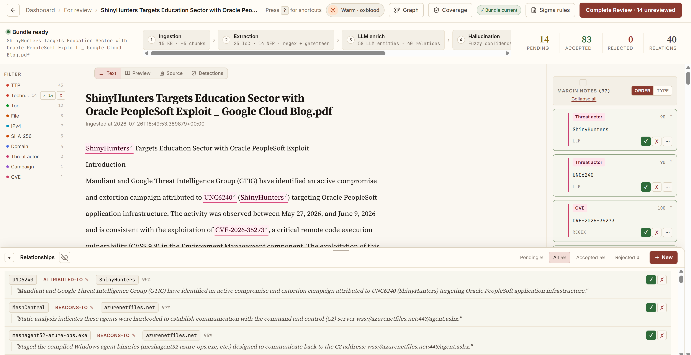
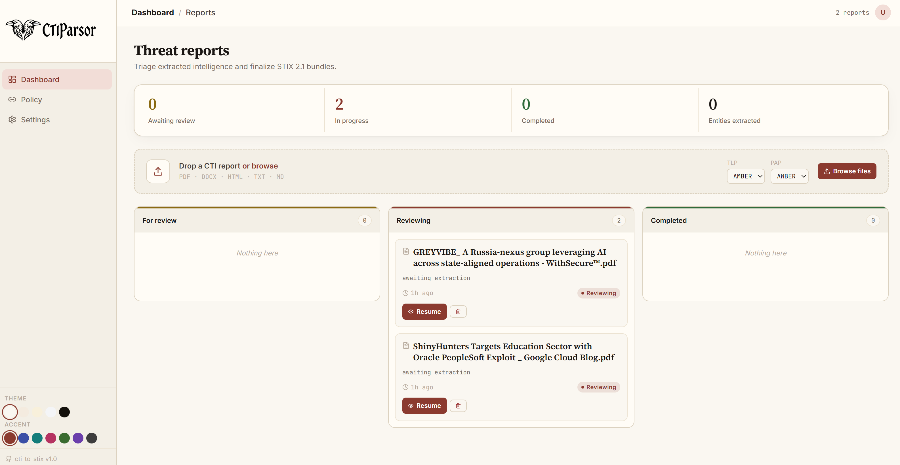
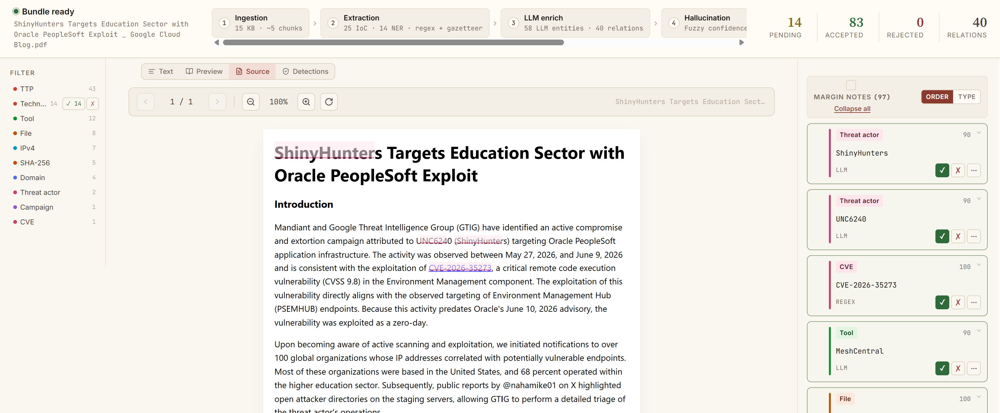
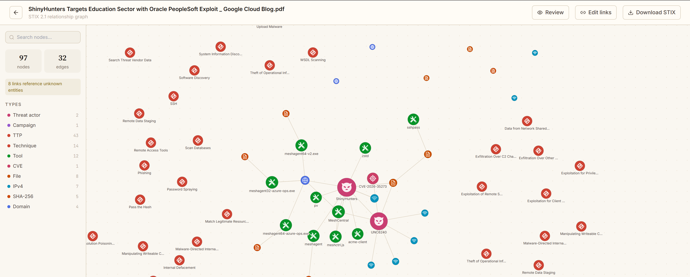
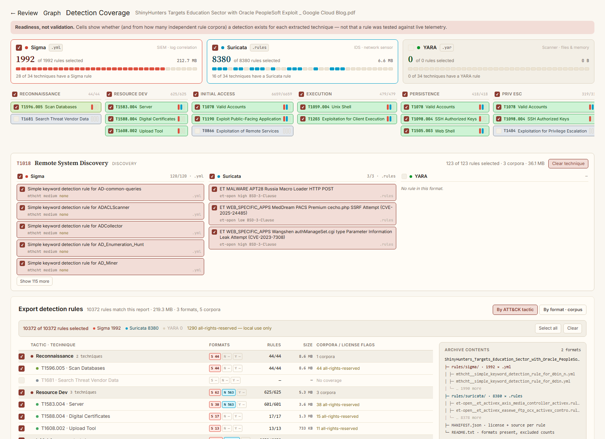
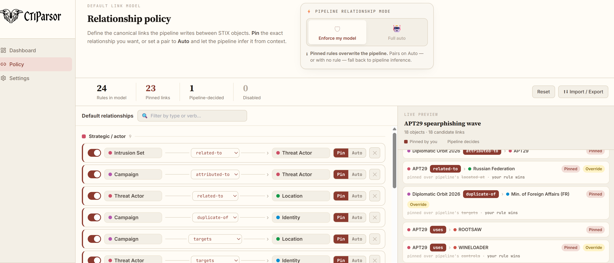
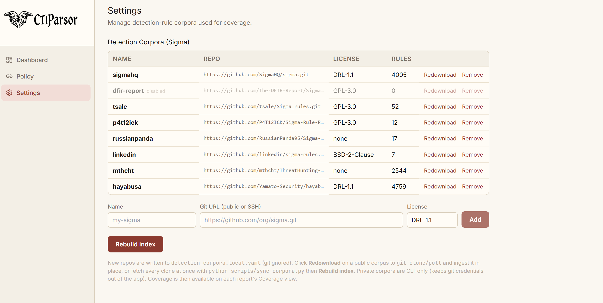
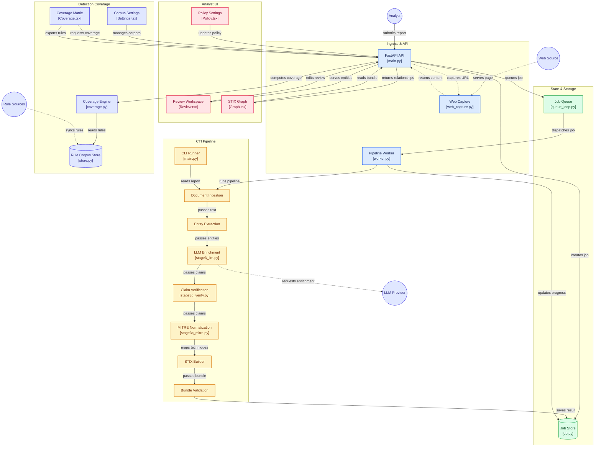
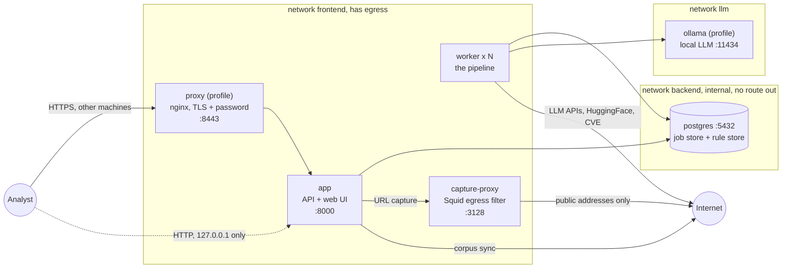

# CTIParsor

**Turn unstructured CTI reports into validated STIX 2.1 bundles, with the evidence behind every claim.**

<p>
  
  
  
  
  
  <a href="LICENSE"></a>
  <a href="https://scorecard.dev/viewer/?uri=github.com/Stixaly/CTIParsor"></a>
</p>

CTIParsor reads a threat-intelligence report — a PDF, DOCX, HTML, TXT or
Markdown file, pasted text, or a URL — and produces a valid **STIX 2.1 bundle**
ready for OpenCTI, MISP or a SIEM.

**Deterministic extraction** (regex + multi-layer NER) does the groundwork;
**LLM enrichment** adds TTPs, relationships and malware attribution. Every LLM
claim then has to survive a **post-LLM hallucination filter**,
**self-verification** of relationship *and* TTP claims (the model must quote
the supporting sentence), optional **cross-model consensus**, and NATO-style
**evidence grading**. Techniques are normalised **offline against MITRE
ATT&CK**, and every bundle carries **STIX provenance markings** (TLP, optional
PAP, authoring identity). The LLM stage is optional: without an API key the
pipeline still produces valid STIX.

Each report is also mapped to a **detection-coverage matrix** against local
**Sigma, Suricata and YARA** corpora, from which you export exactly the rules
you want.

Two ways to use it:

- **Web UI** (React + FastAPI) — interactive review, relationship editing, STIX
  graph with the official OASIS icons, detection coverage and corpus settings.
- **CLI** (`main.py`) — scripting and batch processing.

---

## Contents

- [Highlights](#highlights)
- [Screenshots](#screenshots)
- [Quick start](#quick-start)
- [How it works](#how-it-works)
- [Usage](#usage)
- [What the bundle contains](#what-the-bundle-contains)
- [Detection coverage](#detection-coverage)
- [Configuration](#configuration)
- [Installation and deployment](#installation-and-deployment)
- [Development](#development)
- [Documentation](#documentation)
- [License](#license)

---

## Highlights

- **Hybrid extraction** — regex IoCs (IPs, domains, URLs, hashes, CVEs,
  registry keys, file paths…), an ATT&CK gazetteer, semantic TTP matching,
  CyNER 2.0 and GLiNER zero-shot NER, then LLM enrichment. A vision model can
  read the figures of a PDF too (opt-in).
- **Built against hallucination** — every LLM-returned name is checked against
  the source text, relationships and techniques must be backed by a verbatim
  quote, and each relationship is graded `observed` / `reported` / `assessed` /
  `inferred` / `gap`.
- **Clean STIX 2.1** — ATT&CK normalisation, alias canonicalisation
  (`APT34` = `OilRig`), IoCs routed through Indicators, TLP/PAP markings and
  `created_by_ref` on every object, the source document embedded as an
  `artifact`, and validation before export.
- **Analyst in the loop** — annotated text and original-file views, keyboard
  review, drag-to-relate, an interactive STIX graph, and a relationship policy
  that pins the links you require.
- **Detection coverage** — rules are matched on the report's actual observables,
  not just its ATT&CK tags, ranked with the evidence behind each rank, and
  exported as a ZIP of exactly the rules you selected.
- **Self-hosted and offline-capable** — one hardened Docker Compose stack
  (API, workers, PostgreSQL), local LLMs (Ollama, vLLM, LM Studio), and an
  air-gapped install bundle.

---

## Screenshots

<p align="center">
  
  <br><em>Review workspace — entity annotation, marginalia, and evidence-graded relationship review</em>
</p>

| | |
|:---:|:---:|
| <br>**Dashboard** — drag-and-drop upload + kanban | <br>**Source view** — inline original file (PDF / HTML / TXT / MD) |
| <br>**STIX graph** — relationships with official OASIS icons | <br>**Detection coverage** — per-format readiness + granular rule selection |
| <br>**Relationship policy** — canonical STIX links, pin / auto | <br>**Settings** — Sigma corpus management |

---

## Quick start

Docker is the only supported way to install, develop and run CTIParsor
(ADR-0054) — nothing needs to be on the host but Docker itself (Engine 24+,
Compose v2.24+; about 5 GB for the image and 3.5 GB of volumes after
bootstrap).

```bash
git clone https://github.com/Stixaly/CTIParsor.git && cd CTIParsor
bash setup.sh                    # writes .env + secrets, checks Docker — builds/starts nothing
nano .env                        # set ANTHROPIC_API_KEY=sk-ant-...  (or another LLM_PROVIDER)

docker compose build             # or: make docker-build (stamps the git revision)
docker compose up -d             # → http://127.0.0.1:8000
docker compose --profile bootstrap run --rm bootstrap   # once, 10–20 min: models, corpora, rule store
```

> [!IMPORTANT]
> **`docker compose up -d` alone fetches no detection rules.** The
> Sigma/Suricata/YARA corpora live in the same `postgres` database as the job
> store (ADR-0053) — Postgres being reachable has no bearing on whether
> corpora get downloaded, that only happens once something parses and
> ingests them. Without the `bootstrap` run above, `app` and `worker` start
> fine but Settings → Detection Corpora shows 0 rules for every corpus.
> Bootstrap clones every corpus and rebuilds the store in one process; if you
> instead sync corpora one-by-one from Settings → Redownload, do them **one
> at a time** — each sync rewrites the whole store, and two overlapping ones
> contend for the same rows.

**Process your first report**

- **Web UI** — open <http://127.0.0.1:8000>, drop a file, paste text or give a
  URL, then review the result and download the bundle.
- **CLI** — `docker compose run --rm dev` runs the same image as `app`/`worker`
  with the repo bind-mounted live (ADR-0054):

  ```bash
  docker compose run --rm dev cli input/your_report.pdf --output output/your_report.json
  make run-dir                     # every file already dropped in input/
  ```

Supported input formats: `.pdf` `.docx` `.html` `.htm` `.txt` `.md`

The full container guide is [docs/docker.md](docs/docker.md); moving an
existing install is [docs/upgrading.md](docs/upgrading.md).

---

## How it works

### The pipeline

A report goes through the stages below, in this order. **The API worker, the
`main.py` CLI and the `--stage full` benchmark run the same sequence**
(`pipeline/orchestrator.py`, ADR-0059), and every run records which stages
ran, were skipped (disabled, model missing, no LLM provider) or failed.

| Stage | What it does | Runs |
|---|---|---|
| **1** Ingestion | PDF / DOCX / HTML / TXT / MD → normalised text; OCR for scanned PDFs; refangs `hxxps://`, `[.]`, `[at]`…; paragraph-aware chunks with overlap | always |
| **1f** Figure reading | A vision model transcribes the figures of a PDF (diagrams, screenshots, tables) into the text | opt-in — `VISION_PROVIDER` |
| **2** Regex IoCs | IPs, domains, URLs, emails, MACs, ASNs, paths, registry keys, hashes, CVEs, raw ATT&CK IDs | always |
| **2b** Gazetteer NER | Aho-Corasick scan for the malware, tools and groups ATT&CK knows | always |
| **2c** TTP candidates | Retrieves ranked ATT&CK candidates per passage (descriptions and procedure examples, BM25 and dense) for 3f to choose from; with `TTP_MODE=verify`, emits techniques by sentence-transformer similarity instead | always |
| **2d** CyNER 2.0 | DeBERTa-v3 cybersecurity NER — malware and threat groups | on by default — `CYNER_ENABLED` |
| **2e** GLiNER | Zero-shot NER — sectors, campaigns, infrastructure, actors not yet in ATT&CK | on by default — `GLINER_ENABLED` |
| **2g** Alias lists | Splits "X (aka Y, Z)" constructs into threat-actor names no dictionary knows yet | always |
| **3** LLM enrichment | Actors, malware, tools, TTPs, relationships with an evidence quote, targets, mitigations | with an LLM provider |
| **3b** Hallucination filter | Fuzzy-matches every LLM-returned name against the source chunk | with Stage 3 |
| **3d** Relationship verification | A second LLM call must quote the sentence supporting each relationship; what it cannot decide waits for an analyst, out of the bundle (ADR-0082) | opt-in — `ENABLE_STIX_VERIFICATION` |
| **3f** TTP selection | Chooses the techniques among 2c's candidates and the LLM's proposals, each with a quote the code finds in the text; a failed call ships nothing (`TTP_MODE=verify`: checks the LLM's techniques after the fact) | on in `.env.example` — `ENABLE_TTP_VERIFICATION` |
| **3e** Cross-model consensus | A second provider re-runs relationship-bearing chunks; agreement raises confidence | opt-in — `ENABLE_CONSENSUS` |
| **3doc** Document-level relations | One call over the whole report for relationships between facts stated far apart | opt-in — `ENABLE_DOCUMENT_LEVEL_RELATIONS` |
| **3c** ATT&CK normalisation | Canonical technique names and IDs, once per document; parent dropped when a sub-technique is present | always |
| **2f** CVE enrichment | Description and CVSS v3 score for each CVE, from a local cache; the CIRCL lookup that fills it is opt-in | always (cache) — network with `CVE_ENRICHMENT` |
| **4** STIX mapping | SCOs, SDOs, Indicators, relationships, TLP/PAP markings, authoring identity | always |
| **4b** Graph completion | ATT&CK-curated edges and transitive inference, each labelled as inferred or reported | on by default — policy `completion` |
| **4c** Long-distance prediction | The LLM links disconnected sub-graphs — a quote is required | opt-in — policy `completion.long_distance` |
| **5** Validation & export | `stix2` + `stix2-validator`, then `output/{report}_bundle.json` | always |

Every stage that needs no LLM runs offline once `bootstrap` has cached the
models, except the opt-in CVE lookup. The full stage diagram, what each
quality layer catches and why, the ATT&CK indexes and the offline matrix are in
**[docs/pipeline.md](docs/pipeline.md)**.

### Architecture

High-level component map — ingress/API, the CTI pipeline stages, persistence,
the analyst UI, and the detection-coverage subsystem, with how they talk to
each other and to external services (LLM provider, web sources, rule
corpora). For the file-by-file layout see
[Project structure](docs/development.md#project-structure); for deployment
topology (processes, stores, sizing) see
[docs/architecture.md](docs/architecture.md).


```mermaid
flowchart TD

subgraph group_ingress["Ingress &amp; API"]
  node_api_gateway["FastAPI API<br/>[main.py]"]
  node_web_capture["Web Capture<br/>[web_capture.py]"]
  node_worker["Pipeline Worker<br/>[worker.py]"]
end

subgraph group_pipeline["CTI Pipeline"]
  node_cli_runner["CLI Runner<br/>[main.py]"]
  node_document_ingestion["Document Ingestion"]
  node_entity_extraction["Entity Extraction"]
  node_llm_enrichment["LLM Enrichment<br/>[stage3_llm.py]"]
  node_claim_verification["Claim Verification<br/>[stage3d_verify.py]"]
  node_mitre_normalization["MITRE Normalization<br/>[stage3c_mitre.py]"]
  node_stix_builder["STIX Builder"]
  node_bundle_validation["Bundle Validation"]
end

subgraph group_persistence["State &amp; Storage"]
  node_job_queue["Job Queue<br/>[queue_loop.py]"]
  node_job_store[("Job Store<br/>[db.py]")]
end

subgraph group_ui["Analyst UI"]
  node_review_ui["Review Workspace<br/>[Review.tsx]"]
  node_graph_ui["STIX Graph<br/>[Graph.tsx]"]
  node_policy_ui["Policy Settings<br/>[Policy.tsx]"]
end

subgraph group_coverage["Detection Coverage"]
  node_coverage_ui["Coverage Matrix<br/>[Coverage.tsx]"]
  node_settings_ui["Corpus Settings<br/>[Settings.tsx]"]
  node_coverage_engine["Coverage Engine<br/>[coverage.py]"]
  node_rule_store[("Rule Corpus Store<br/>[store.py]")]
end

node_analyst(("Analyst"))
node_web_source(("Web Source"))
node_llm_provider(("LLM Provider"))
node_corpus_sources(("Rule Sources"))

node_analyst -->|"submits report"| node_api_gateway
node_web_source -.->|"serves page"| node_web_capture
node_api_gateway -.->|"captures URL"| node_web_capture
node_web_capture -.->|"returns content"| node_api_gateway
node_api_gateway -->|"creates job"| node_job_store
node_api_gateway -->|"queues job"| node_job_queue
node_job_queue -->|"dispatches job"| node_worker
node_worker -->|"runs pipeline"| node_document_ingestion
node_cli_runner -->|"reads report"| node_document_ingestion
node_document_ingestion -->|"passes text"| node_entity_extraction
node_entity_extraction -->|"passes entities"| node_llm_enrichment
node_llm_enrichment -.->|"requests enrichment"| node_llm_provider
node_llm_enrichment -->|"passes claims"| node_claim_verification
node_claim_verification -->|"passes claims"| node_mitre_normalization
node_mitre_normalization -->|"maps techniques"| node_stix_builder
node_stix_builder -->|"passes bundle"| node_bundle_validation
node_bundle_validation -->|"saves result"| node_job_store
node_worker -->|"updates progress"| node_job_store
node_review_ui -->|"edits review"| node_api_gateway
node_api_gateway -->|"serves entities"| node_review_ui
node_graph_ui -->|"reads bundle"| node_api_gateway
node_api_gateway -->|"returns relationships"| node_graph_ui
node_policy_ui -->|"updates policy"| node_api_gateway
node_settings_ui -->|"manages corpora"| node_api_gateway
node_coverage_ui -->|"requests coverage"| node_api_gateway
node_api_gateway -->|"computes coverage"| node_coverage_engine
node_coverage_engine -->|"reads rules"| node_rule_store
node_corpus_sources -.->|"syncs rules"| node_rule_store
node_coverage_ui -->|"exports rules"| node_api_gateway

click node_api_gateway "https://github.com/stixaly/ctiparsor/blob/main/api/main.py"
click node_web_capture "https://github.com/stixaly/ctiparsor/blob/main/pipeline/web_capture.py"
click node_job_queue "https://github.com/stixaly/ctiparsor/blob/main/api/queue_loop.py"
click node_job_store "https://github.com/stixaly/ctiparsor/blob/main/api/db.py"
click node_worker "https://github.com/stixaly/ctiparsor/blob/main/api/worker.py"
click node_cli_runner "https://github.com/stixaly/ctiparsor/blob/main/main.py"
click node_document_ingestion "https://github.com/stixaly/ctiparsor/blob/main/pipeline/stage1_ingestion.py"
click node_entity_extraction "https://github.com/stixaly/ctiparsor/blob/main/pipeline/stage2_extraction.py"
click node_llm_enrichment "https://github.com/stixaly/ctiparsor/blob/main/pipeline/stage3_llm.py"
click node_claim_verification "https://github.com/stixaly/ctiparsor/blob/main/pipeline/stage3d_verify.py"
click node_mitre_normalization "https://github.com/stixaly/ctiparsor/blob/main/pipeline/stage3c_mitre.py"
click node_stix_builder "https://github.com/stixaly/ctiparsor/blob/main/pipeline/stage4_stix_mapping.py"
click node_bundle_validation "https://github.com/stixaly/ctiparsor/blob/main/pipeline/stage5_validation.py"
click node_review_ui "https://github.com/stixaly/ctiparsor/blob/main/frontend/src/pages/Review.tsx"
click node_graph_ui "https://github.com/stixaly/ctiparsor/blob/main/frontend/src/pages/Graph.tsx"
click node_policy_ui "https://github.com/stixaly/ctiparsor/blob/main/frontend/src/pages/Policy.tsx"
click node_coverage_ui "https://github.com/stixaly/ctiparsor/blob/main/frontend/src/pages/Coverage.tsx"
click node_settings_ui "https://github.com/stixaly/ctiparsor/blob/main/frontend/src/pages/Settings.tsx"
click node_coverage_engine "https://github.com/stixaly/ctiparsor/blob/main/pipeline/detection/coverage.py"
click node_rule_store "https://github.com/stixaly/ctiparsor/blob/main/pipeline/detection/store.py"

classDef toneNeutral fill:#f8fafc,stroke:#334155,stroke-width:1.5px,color:#0f172a
classDef toneBlue fill:#dbeafe,stroke:#2563eb,stroke-width:1.5px,color:#172554
classDef toneAmber fill:#fef3c7,stroke:#d97706,stroke-width:1.5px,color:#78350f
classDef toneMint fill:#dcfce7,stroke:#16a34a,stroke-width:1.5px,color:#14532d
classDef toneRose fill:#ffe4e6,stroke:#e11d48,stroke-width:1.5px,color:#881337
classDef toneIndigo fill:#e0e7ff,stroke:#4f46e5,stroke-width:1.5px,color:#312e81
classDef toneTeal fill:#ccfbf1,stroke:#0f766e,stroke-width:1.5px,color:#134e4a
class node_api_gateway,node_web_capture,node_worker toneBlue
class node_cli_runner,node_document_ingestion,node_entity_extraction,node_llm_enrichment,node_claim_verification,node_mitre_normalization,node_stix_builder,node_bundle_validation toneAmber
class node_job_queue,node_job_store toneMint
class node_review_ui,node_graph_ui,node_policy_ui toneRose
class node_coverage_ui,node_settings_ui,node_coverage_engine,node_rule_store,node_analyst,node_web_source,node_llm_provider,node_corpus_sources toneIndigo
```

### Containers

How the stack runs: the containers, their networks and ports, and what
reaches the internet.


```mermaid
flowchart LR
    analyst(("Analyst"))
    internet(("Internet"))
    subgraph frontend ["network frontend, has egress"]
        proxy["proxy (profile)<br/>nginx, TLS + password<br/>:8443"]
        app["app<br/>API + web UI<br/>:8000"]
        worker["worker x N<br/>the pipeline"]
        capproxy["capture-proxy<br/>Squid egress filter<br/>:3128"]
    end
    subgraph backend ["network backend, internal, no route out"]
        pg[("postgres :5432<br/>job store + rule store")]
    end
    subgraph llm ["network llm"]
        ollama["ollama (profile)<br/>local LLM :11434"]
    end
    analyst -->|"HTTPS, other machines"| proxy --> app
    analyst -.->|"HTTP, 127.0.0.1 only"| app
    app --> pg
    worker --> pg
    worker --> ollama
    app -->|"URL capture"| capproxy -->|"public addresses only"| internet
    app -->|"corpus sync"| internet
    worker -->|"LLM APIs, HuggingFace, CVE"| internet
```

| Container | Image | What runs in it | Port |
|---|---|---|---|
| `app` | the CTIParsor image, command `serve` | the API, the web UI, URL capture, finalize | 8000, published on 127.0.0.1 |
| `worker` | the same image, command `worker` | the pipeline, one subprocess per report | none |
| `bootstrap` (run once) | the same image, command `bootstrap` | the schema, the models, the corpora, the rule store | none |
| `postgres` | `postgres:18-alpine` | both stores, and the job queue | 5432, internal |
| `capture-proxy` | Squid | the URL tab's egress filter | 3128, internal |
| `proxy` (profile) | nginx | TLS and a password in front of `app` | 8443, published |
| `ollama` (profile) | Ollama | a local LLM | 11434, internal |

**One image for three roles.** `app`, `worker` and `bootstrap` are the image
published to `ghcr.io/stixaly/ctiparsor`, started with different commands, so
the API and the workers always run the same code (ADR-0044). The other
containers run upstream images, pinned by digest and configured from
`docker/`.

[docs/architecture.md §2](docs/architecture.md#2-the-pieces) has the details:
the code in each container, every flow with its port, and every outbound
destination with the setting that turns it off.

---

## Usage

### Web UI

```
Ingest — one of three (ADR-0029)
  │   File   drag-and-drop or file picker (PDF/DOCX/HTML/TXT/MD, 50 MB)
  │   Paste  plain text, Markdown, or HTML source — markup is stripped
  │   URL    headless Chromium renders the page server-side; the PDF is
  │          archived for review, its DOM text is what gets ingested
  │
  ▼
Processing  ─── Real-time progress bar (SSE)
  ▼
For Review  ──►  Reviewing  ──►  Completed
  (Kanban)       (Review page)   (Graph + Download)
```

| Page | What you do there |
|---|---|
| **Dashboard** | Ingest reports, follow their progress, track them on a kanban board |
| **Review** | Accept, reject or add entities and relationships on the annotated text, a rendered preview, the original file, or the ranked **Detections** tab — with keyboard shortcuts |
| **Graph** | Explore the bundle that will ship, see why each link exists, edit links, download the bundle |
| **Policy** (`/policy`) | Choose which `source → verb → target` links are pinned, and how graph completion behaves |
| **Coverage** (`/coverage/:jobId`) | Read the detection-coverage matrix, select rules, export them |
| **Settings** (`/settings`) | Manage the detection-rule corpora |

Page-by-page guide, keyboard shortcuts and auto-accept rules:
[docs/web-ui.md](docs/web-ui.md).

### CLI

```bash
docker compose run --rm dev cli input/report.pdf                          # one file
docker compose run --rm dev cli input/report.pdf --output output/apt29.json
docker compose run --rm dev cli --input-dir input/ --output-dir output/   # a whole folder

docker compose run --rm dev cli input/report.pdf --no-llm                 # no LLM call
docker compose run --rm dev cli input/report.pdf --disable-stage 2d,2e    # ablation
docker compose run --rm dev cli input/report.pdf --require-stage 3        # fail if the LLM cannot run
```

Stage ids: `1 1f 2 2b 2c 2d 2e 2g 3 3d 3f 3e 3doc 2f 4 4b 4c 5`.
`PIPELINE_DISABLED_STAGES` (comma-separated) does the same for every run of a
process, the API worker included. The CLI applies the relationship policy
saved in the job store, like the worker (`--policy db`, the default), or
`--policy none` / `--policy file.json`.

### REST API

Everything the UI does goes through a REST API: upload and ingestion, jobs,
entities, relationships, the relationship policy, progress (SSE), coverage and
rule export, queue status, corpora and NER thresholds. Interactive docs are
served at `http://localhost:8000/docs`; the reference is
[docs/api.md](docs/api.md).

---

## What the bundle contains

- **Observables** — one SCO per IoC: `ipv4-addr` / `ipv6-addr`, `domain-name`,
  `url`, `email-addr`, `file` (hashes, paths, file names), `mac-addr`,
  `autonomous-system`, `windows-registry-key`.
- **Domain objects** — `attack-pattern` (ATT&CK, with its external reference),
  `malware`, `threat-actor`, `intrusion-set`, `tool`, `campaign`,
  `vulnerability` (CVE), `infrastructure`, `course-of-action`, and the targets:
  `location` (country) and `identity` (sector).
- **Indicators** — every accepted IoC gets an `indicator` with its STIX
  pattern, linked `based-on` to the observable. A YARA, Suricata, Snort or
  Sigma rule quoted in the report becomes an `indicator` holding the rule
  itself — only if it compiles or parses the way OpenCTI requires.
- **Relationships** — `relationship` SROs with a confidence score and an
  evidence grade (`x_evidence_label`); edges added by graph completion or by
  the policy say which rule produced them.
- **Provenance** — a TLP (and optional PAP) marking and `created_by_ref` on
  every object, the source document as an `artifact` SCO, and a `report` SDO
  wrapping it all.

Full mapping table and custom properties: [docs/stix-output.md](docs/stix-output.md).

---

## Detection coverage

Each report is scored against local rule corpora — a mix of **public** repos
(committed in `detection_corpora.yaml`, reproducible) and **private** repos
(the gitignored `detection_corpora.local.yaml` overlay). This is detection
*readiness*, not lab validation.

| Format | Extension | Deploys to |
|---|---|---|
| Sigma | `.yml` | SIEM · log correlation |
| Suricata | `.rules` | IDS · network sensor |
| YARA | `.yar` | Scanner · files & memory |

A real store is **52,481 Suricata**, **22,303 YARA** and **11,396 Sigma**
rules, and coverage, drill-in and export keep the three languages distinct
throughout (ADR-0015 / ADR-0022).

- **The Coverage page** lays the report's ATT&CK techniques out by tactic and
  colours each by a readiness score: rules in two or more corpora, in one, or
  in none. The rules listed under a technique are only those that hold a value
  the report actually contains — a hash, domain, path, tool or malware name
  (ADR-0030) — because sharing an ATT&CK tag says little about the report:
  across two real reports the tag join selects **25,493 rules of which 4 match
  anything in them**.
- **Artifact coverage** (ADR-0025) scores the report's own hashes, addresses,
  domains, paths, registry keys, tools and malware names instead of its
  techniques, grouped by **Pyramid of Pain** tier. It is served by
  `GET /api/jobs/{id}/coverage/artifacts`; the UI does not show it yet.
- **Rule proposals** — the Review page's **Detections** tab ranks rules on the
  report's observables (weighted by how rare each value is) and platform, and
  shows which value matched which rule field (ADR-0014).
- **Granular export** — select per rule, technique, tactic, corpus or format,
  then download a ZIP with each rule in its native extension and a manifest
  of licences and exclusions.

The `bootstrap` run already clones the corpora and builds the rule store. Two
things it leaves to you:

```bash
docker compose run --rm app python scripts/build_rule_text.py   # rule-title index for brand evidence (ADR-0031) — never built by bootstrap
docker compose --profile bootstrap run --rm bootstrap --no-models  # later: re-clone every corpus and rebuild the store
```

Walkthrough, scoring details and troubleshooting:
[docs/detection-coverage.md](docs/detection-coverage.md).

---

## Configuration

All configuration lives in `.env`, which `setup.sh` creates from
`.env.example`. The one choice you have to make is the LLM provider:

| Provider | `LLM_PROVIDER` | Settings | Runs locally |
|---|---|---|---|
| Anthropic (default) | `anthropic` | `ANTHROPIC_API_KEY`, `ANTHROPIC_MODEL` | |
| Google Gemini | `gemini` | `GEMINI_API_KEY`, `GEMINI_MODEL` | |
| Mistral AI | `mistral` | `MISTRAL_API_KEY`, `MISTRAL_MODEL` | |
| Ollama | `ollama` | `OLLAMA_BASE_URL`, `OLLAMA_MODEL` | ✅ (`--profile ollama`) |
| vLLM | `vllm` | `VLLM_BASE_URL`, `VLLM_MODEL` | ✅ |
| LM Studio | `lmstudio` | `LMSTUDIO_BASE_URL`, `LMSTUDIO_MODEL` | ✅ |

With no provider configured (e.g. `ANTHROPIC_API_KEY` left unset), Stage 3 is
skipped and the pipeline still produces a valid STIX bundle from every offline
stage.

Other settings worth knowing:

| Setting | What it controls |
|---|---|
| `VISION_PROVIDER` | Stage 1f figure reading — `none` (default), `anthropic`, `ollama`, `mistral`, `vllm` |
| `ENABLE_STIX_VERIFICATION` / `ENABLE_TTP_VERIFICATION` | Stages 3d / 3f self-verification |
| `ENABLE_CONSENSUS` + `CONSENSUS_PROVIDER` | Stage 3e cross-model consensus |
| `TTP_EMBEDDING_MODEL`, `GLINER_MODEL` | The Stage 2c and 2e models |
| `STIX_TLP`, `STIX_AUTHOR_NAME` | The marking and authoring identity stamped on every object |
| `JOB_RETENTION_DAYS` | Delete finished reports older than N days — `0`, the default, keeps them until someone deletes them |
| `DATABASE_URL` | PostgreSQL — set for you by `compose.yaml` |

Every variable, with its default and the reasoning behind it:
[docs/configuration.md](docs/configuration.md).

---

## Installation and deployment

### What the container stack gives you

- runs as a non-root user on a **read-only root filesystem** with every Linux
  capability dropped; the Chromium sandbox for the URL tab stays **on** via
  the seccomp profile in `docker/` (the usual `--no-sandbox` shortcut is not
  taken);
- splits the API from the pipeline: `app` only queues reports, one or more
  `worker` containers claim and run them from the PostgreSQL job store
  (ADR-0046, `--scale worker=2`), each with its own measured CPU and memory
  limit;
- keeps uploads and outputs on the `cti-state` volume, both the reports and
  the rule corpus in the `postgres` service (ADR-0045, ADR-0053), and the
  2.6 GB of models plus the corpora source clones on the rebuildable
  `cti-cache` volume;
- publishes the API on **127.0.0.1 only**, the same posture as `run_api.py`;
  the `proxy` profile adds TLS and a password in front (`docker compose
  --profile proxy up -d`), the `ollama` profile a local LLM with no published
  port;
- sends the URL tab's Chromium through `capture-proxy`, a Squid egress filter
  that only lets it reach public addresses;
- adds isolation, **not authentication** — [docs/deployment.md §2](docs/deployment.md#2-what-no-authentication-actually-means)
  applies unchanged.

`bash scripts/docker_smoke.sh` builds, starts and verifies all of the above.

> [!WARNING]
> **Do not run the API/worker containers as root**, and don't set
> `CTIPARSOR_ROLE=all` under `sudo`. URL ingestion (ADR-0029) renders the
> page in a sandboxed Chromium, and Chromium refuses to run as root with its
> sandbox on — the images already run as a non-root user (uid 1001) for
> exactly this reason. A container runtime that genuinely cannot grant
> unprivileged user namespaces can set `CTIPARSOR_CAPTURE_UNSANDBOXED=1`,
> which renders without the sandbox and logs a warning naming the risk on
> every capture.

### What `setup.sh` does

It only prepares the environment — it builds, downloads and starts nothing:

```
[1]   Docker            — checks docker + docker compose (or docker-compose v1)
                           are on PATH and the daemon is reachable
[2]   .env              — creates it from .env.example if missing; generates
                           CTI_DB_PASSWORD if not already set
[3]   DB password secret — writes .secrets/db_password from CTI_DB_PASSWORD
                           (compose.yaml bind-mounts it into every service)
```

Everything the old host install did — system packages, the Python/Node
toolchains, NLP models, MITRE data, the detection corpora, the frontend
build — is now either baked into the image (`Dockerfile`) or done by
`docker compose --profile bootstrap run --rm bootstrap`.

### Offline (air-gapped) installation

Docker itself is the only thing that has to already be on the air-gapped
host (ADR-0054, supersedes ADR-0040's wheel/deb bundle). Build a bundle on a
**connected machine with Docker, the same CPU architecture as the target**
— Docker images are architecture-specific:

```bash
# On the connected machine, after a normal `bash setup.sh`:
bash scripts/package_offline_docker.sh              # add --with-llm[=MODEL] for a local Ollama model
# → dist/cti-parsor-offline-docker-<rev>-<arch>.tar (+ .sha256)

# Before transferring it, verify it restores and the stack actually works
# (run this on a machine you're willing to cut network access to):
tar xf dist/cti-parsor-offline-docker-*.tar
bash scripts/check_offline_bundle_docker.sh offline

# On the air-gapped host:
tar xf cti-parsor-offline-docker-*.tar
bash setup.sh --offline=offline
docker compose up -d
```

The bundle carries a saved copy of every image the stack needs (`app`,
`postgres`, `capture-proxy`, and `ollama` if `--with-llm` was used), a tar of
the `cti-cache` volume (NLP models + corpus clones), and a `pg_dump` export
of the job/rule store — everything `docker compose --profile bootstrap run
--rm bootstrap` would otherwise fetch over the network. `setup.sh --offline`
verifies the bundle's checksums and architecture before touching anything,
`docker load`s the images, restores the volumes and database, and leaves
`docker compose up -d` as the only remaining step — no `bootstrap` run
needed, the data is already there. Corpora and models are frozen at the
bundle's build date (`offline/bundle.env`); rebuild and re-transfer to
update them.

### Going further

| Guide | For |
|---|---|
| [docs/docker.md](docs/docker.md) | Running the stack day to day: volumes, backups, scaling, troubleshooting |
| [docs/deployment.md](docs/deployment.md) | Serving several analysts: bind address, what "no authentication" means, TLS proxy, systemd |
| [docs/architecture.md](docs/architecture.md) | Processes, stores, the life of a report, sizing |
| [docs/upgrading.md](docs/upgrading.md) | Moving an existing install to PostgreSQL and workers |
| [SECURITY.md](SECURITY.md) | Security model, its limits, and reporting a vulnerability |

---

## Development

**Development mode** (live reload, no host Python/Node install):

```bash
docker compose run --rm dev pytest -v                # or: make test
docker compose --profile dev up frontend-dev           # Vite HMR → http://localhost:5173
```

`dev` bind-mounts the repo over `/app` (edits need no rebuild); `frontend-dev`
bind-mounts `frontend/` into a plain `node:24` container and proxies `/api`
to the `app` service. Both are `profiles: [dev]`, so a plain
`docker compose up -d` never starts them.

| Command | Description |
|---|---|
| `make test` | Run all tests, in the `dev` container — no API key needed, the LLM is mocked |
| `make ci` | Every check the pull-request CI runs, locally: lint, types, tests + coverage floors, frontend |
| `make run` | Run the pipeline on `tests/fixtures/sample_report.txt` |
| `make check` | Diagnostic: list which pipeline stages are available |
| `make check-docs` | Verify the numbers claimed in the docs against the source of truth (CI runs it too) |
| `make audit` | Scan Python + npm dependencies for known CVEs |

The full list of `make` targets, the extraction-quality benchmarks, the
project structure and the usual extension points are in the
**[development guide](docs/development.md)**. Before opening a pull request,
read [CONTRIBUTING.md](CONTRIBUTING.md); the test strategy is in
[TESTING.md](TESTING.md), the evaluation protocol in
[docs/eval/README.md](docs/eval/README.md), and every design decision in the
[ADRs](docs/adr/README.md).

---

## Documentation

| Topic | Page |
|---|---|
| Every pipeline stage, the quality layers, ATT&CK data, offline support | [docs/pipeline.md](docs/pipeline.md) |
| The full `.env` reference | [docs/configuration.md](docs/configuration.md) |
| The web UI, page by page | [docs/web-ui.md](docs/web-ui.md) |
| What each extracted value becomes in STIX | [docs/stix-output.md](docs/stix-output.md) |
| Detection coverage, walkthrough | [docs/detection-coverage.md](docs/detection-coverage.md) |
| REST API reference | [docs/api.md](docs/api.md) |
| Database schema | [docs/database-schema.md](docs/database-schema.md) |
| Containers, deployment, architecture, upgrades | [docker](docs/docker.md) · [deployment](docs/deployment.md) · [architecture](docs/architecture.md) · [upgrading](docs/upgrading.md) |
| Development guide: `make` targets, benchmarks, project structure, extending | [docs/development.md](docs/development.md) |
| Dependencies and how to keep them current | [docs/dependencies.md](docs/dependencies.md) |
| Evaluation protocol | [docs/eval/README.md](docs/eval/README.md) |
| Architecture Decision Records | [docs/adr/README.md](docs/adr/README.md) |
| Review of STIX relationship generation (in French) | [docs/stix-relationships-review.md](docs/stix-relationships-review.md) |
| Tests, security, contributing, changes | [TESTING.md](TESTING.md) · [SECURITY.md](SECURITY.md) · [CONTRIBUTING.md](CONTRIBUTING.md) · [CHANGELOG.md](CHANGELOG.md) |

---

## License

CTIParsor is released under the [Apache License 2.0](LICENSE).
