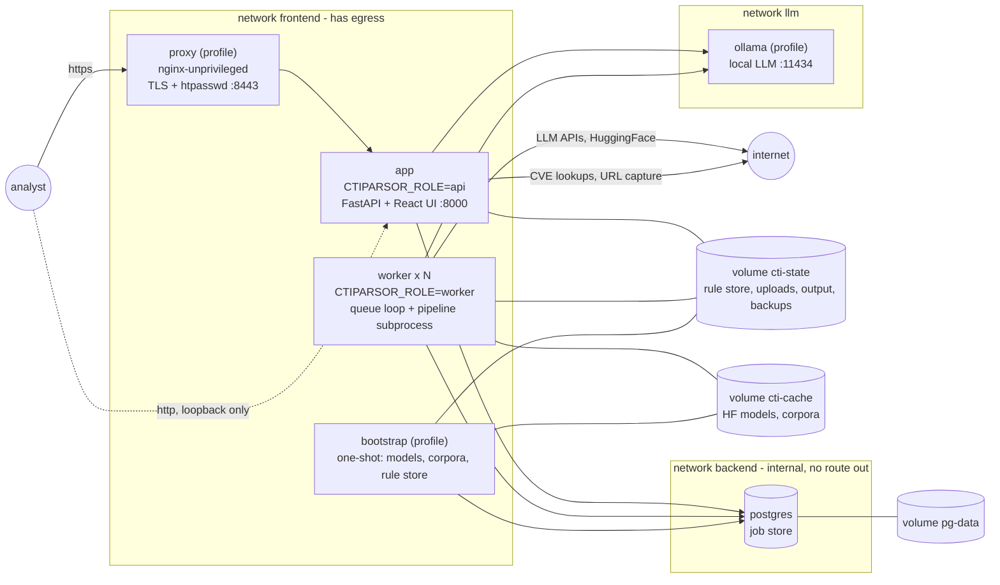
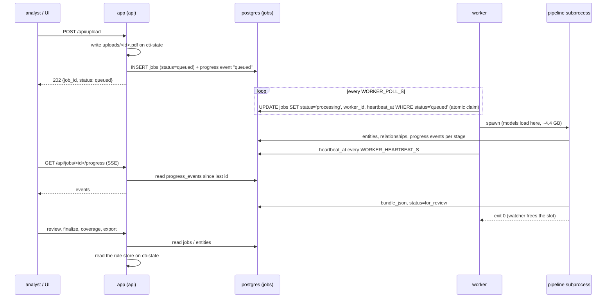

# Deployment architecture

How CTIParsor runs after ADR-0044, ADR-0045 and ADR-0046 (September 2026):
what the processes are, where the data lives, how a report travels from
upload to bundle, and which of it applies to a plain host install versus the
container stack. The three ADRs hold the measurements and the alternatives
that were rejected; this page is the map.

## 1. The two shapes it runs in

The same code runs in two shapes, chosen by environment variables, with no
code path that exists only for containers.

| | Host install (`bash setup.sh`, `python run_api.py`) | Container stack (`docker compose up -d`) |
|---|---|---|
| Processes | one: the API, with the pipeline loop in a background thread | four always on: `app`, `worker` (×N), `postgres`, plus optional `proxy` and `ollama` |
| Job store (reports) | `cti_stix.db` | PostgreSQL 17, service `postgres` |
| Rule store (detection corpus) | `cti_stix.db` | `cti_stix.db` on the `cti-state` volume |
| Who runs the pipeline | the API process (`CTIPARSOR_ROLE=all`) | the `worker` containers (`CTIPARSOR_ROLE=worker`); the API only queues (`api`) |
| Exposure | loopback by default (`API_HOST`) | loopback by default (`CTI_BIND`); `proxy` profile for TLS + password |

Everything in the right column is opt-in on the left: a host install may set
`DATABASE_URL` and run `python -m api.queue_loop` as a service, and gets the
same split without containers.

## 2. The pieces

| Piece | Image | What it does | Owns |
|---|---|---|---|
| `app` | `ctiparsor` (this repo's `Dockerfile`) | serves the API and the built web UI on one port; accepts uploads, pasted text and URLs; queues them; serves progress (SSE), review, coverage, export; runs the corpus rebuild from the Settings page | nothing persistent of its own |
| `worker` | same image, `command: worker` | claims queued reports, runs each in an isolated subprocess (models loaded there), writes entities, relationships, the bundle and progress events | its lease on the jobs it runs |
| `postgres` | `postgres:17-alpine` | the **job store**: `jobs`, `entities`, `relationships`, `progress_events`, `relationship_policy`, `report_figures`, `figure_reads`, `cve_cache` | volume `pg-data` |
| `cti-state` volume | — | the **rule store** (`cti_stix.db`: 87 k detection rules, FTS5), `uploads/`, `output/`, `backups/`, the private corpus overlay | back it up together with `pg-data` |
| `cti-cache` volume | — | 2.6 GB of HuggingFace models, 0.7 GB of corpus clones | rebuildable with `bootstrap` |
| `proxy` (profile) | `nginxinc/nginx-unprivileged` | TLS termination and HTTP basic auth, the only thing meant to be published on a network | certs and htpasswd you provide |
| `ollama` (profile) | `ollama/ollama` | a local LLM for Stage 3 and Stage 1f, reachable only from `app` and `worker` | volume `ollama-models` |
| `bootstrap` (profile) | same image, `command: bootstrap` | one shot: creates the schema, downloads the models, clones the corpora, builds the rule store | — |

**Why two stores.** The per-report tables are ordinary relational data and
moved to PostgreSQL so that several processes can write them, a real
database can be backed up and monitored, and the API can be stateless. The
detection corpus is an FTS5 full-text index with planner hints that
PostgreSQL has no equivalent for; it is batch-built, read-mostly, and stays a
SQLite file (ADR-0045). In code this is `api.db.get_conn()` for the job store
and `api.db.get_rule_conn()` for the rule store; without `DATABASE_URL` both
return the same connection, which is what keeps the host install and the
test suite on one file.

## 3. The life of a report

Three properties fall out of this:

- **The table is the queue.** There is no broker. A claim is one conditional
  `UPDATE` with a rowcount check, atomic on both engines. Several workers
  cannot run the same report because of the lease: a `processing` row is only
  requeued when its `heartbeat_at` is older than `WORKER_LEASE_TIMEOUT_S`
  (180 s), by whichever worker notices (ADR-0046).
- **A crash costs the run, not the report.** The pipeline runs in a
  subprocess; an OOM kill or a native crash ends that process, the worker's
  watcher marks the job `failed` and frees the slot. A worker that dies
  mid-report leaves a row whose lease expires; the next worker resumes it
  from its Stage 3 checkpoint.
- **The UI never talks to a worker.** Progress, review and export all read
  the job store through the API, which is why the API can be restarted or
  scaled while reports run.

## 4. Configuration in one place

Everything is in `.env`; `.env.example` documents each variable. The
container stack reads the same file twice — once to fill its own `${...}`
values, once to pass it to every container — so the LLM keys, the pipeline
flags, the database password and the resource limits live together.

| Variable | Host install | Container stack |
|---|---|---|
| `DATABASE_URL`, `PGPASSWORD` | optional, points the job store at PostgreSQL | set by compose to the `postgres` service |
| `CTI_DB_PASSWORD`, `CTI_DB_USER`, `CTI_DB_NAME` | unused | required password; user and database created on first start |
| `CTIPARSOR_ROLE` | `all` (default), or `api` / `worker` for a split install | set by compose per service |
| `WORKER_MAX_CONCURRENT` | reports in flight in the API process | reports in flight **per worker container** |
| `WORKER_HEARTBEAT_S`, `WORKER_LEASE_TIMEOUT_S`, `WORKER_POLL_S`, `WORKER_DRAIN_S` | the lease and loop timings | same |
| `CTI_BIND`, `CTI_PORT`, `CTI_TLS_BIND`, `CTI_TLS_PORT` | unused | where the host publishes the API and the proxy |
| `CTI_<SERVICE>_CPUS`, `CTI_<SERVICE>_MEMORY` | unused | per-container limits (see §6) |
| `API_HOST`, `API_PORT`, `API_RELOAD` | the bind address of the single process | forced by compose; the host side is `CTI_BIND` |

## 5. Security controls, and their limits

| Control | Where | What it stops |
|---|---|---|
| non-root user 1001, `/app` owned by root, read-only root filesystem, tmpfs scratch | `app`, `worker`, `bootstrap` | a parser or renderer exploit cannot get root or rewrite the code |
| every Linux capability dropped, `no-new-privileges` | all services | no privilege escalation path |
| seccomp profile that keeps the Chromium sandbox **on** | `app`, `worker` | a hostile web page stays inside Chromium's user namespace (`docker/seccomp-chromium.json`, which had to allow `chroot` for the zygote) |
| pids limit 4096 | `app`, `worker`, `bootstrap` | a fork bomb from a hostile document |
| `backend` network is internal | `postgres` | the database has no route to the internet, even if compromised |
| three networks | all | the proxy never sees the database or the LLM; the LLM never sees the database |
| no published port except the API on loopback and the proxy | all | nothing else is reachable from outside the host |
| PostgreSQL `scram-sha-256` for every connection, password via `PGPASSWORD` | `postgres`, `app`, `worker` | no plaintext or trust auth; the password is never in a URL that could be logged |
| secrets excluded from the image (`.dockerignore`), passed by `env_file` | build | an image pushed to a registry carries no key and no report |
| pinned base images, CPU-only torch, memory and CPU limits | build, compose | no `latest`, no 2.2 GB of CUDA wheels, no runaway container |

What it does **not** do, stated plainly: the application has no
authentication. Anyone who can reach the API port shares one workspace and
can read, edit and delete every report. The proxy profile puts a password in
front; it does not add users. Traffic between containers is not TLS (it never
leaves a private bridge on one host; see `docs/deployment.md` for the
multi-host case). API keys are readable through `docker inspect` by whoever
holds the Docker socket.

## 6. Sizing

Measured on this codebase; adjust in `.env`.

| Service | CPUs | Memory limit | Reserved | Basis |
|---|---|---|---|---|
| `app` | 2 | 3 GB | 512 MB | 130 MB idle; a Settings-page corpus rebuild peaked at 2.2 GB |
| `worker` | 4 | 6 GB | 4 GB | 4.4 GB per report plus the supervisor; add 4.4 GB per extra `WORKER_MAX_CONCURRENT` |
| `postgres` | 1 | 512 MB | 128 MB | a few MB per report |
| `proxy` | 0.5 | 128 MB | — | nginx |
| `bootstrap` | 2 | 4 GB | — | downloads plus the rule parse |
| `ollama` | 8 | 12 GB | — | a 7B model in Q4 on CPU; 27B needs ~18 GB and a GPU |

Throughput scales by adding workers (`docker compose up -d --scale
worker=2`), each with the limit above, on one host; several hosts would need
the uploads and the rule store on shared or object storage, which is not
done.

## 7. Decisions, and what was rejected

| Decision | ADR | Rejected alternatives |
|---|---|---|
| one application image with several commands (`serve`, `worker`, `bootstrap`, `cli`, `check`) | 0044 | separate images per role; a frontend container; baking models into the image |
| no database container at first, then PostgreSQL for the job store only | 0044 → 0045 | PostgreSQL for everything (the FTS5 corpus cannot move); an ORM; a routing connection that picks a store by table name |
| a driver adapter (165 lines) instead of rewriting the SQL | 0045 | SQLAlchemy; PostgreSQL-only with no SQLite path |
| the `jobs` table as the queue, a lease for multiple workers | 0046 | Celery/RQ/ARQ + Redis; `FOR UPDATE SKIP LOCKED` (deferred, not needed at this scale) |
| Chromium stays in the app image, sandboxed by seccomp | 0044 | a browser container (deferred; the next hardening step) |
| publish the image to GHCR, gated on the smoke test | 0047 | Docker Hub (a second account and secret for no new capability); publishing every PR |
| one read-only status endpoint for backlog and worker liveness | 0048 | a Prometheus exporter (this codebase's first metrics dependency, for a question one endpoint answers); a frontend dashboard panel (deferred, not rejected) |

## 8. Operating it: image delivery and backlog visibility

Two things a deployment needs day to day, neither of them the deployment
model itself:

- **Getting the image onto a second host.** Every push to `main` publishes
  to `ghcr.io/stixaly/ctiparsor`, tagged `latest` and `sha-<full sha>`, gated
  on the same smoke test the container-image CI job already runs
  (ADR-0047). `docker compose pull` then `up` uses it without a local
  build — verified against this repo's own compose file, not assumed.
- **Seeing whether the queue is backing up.** `GET /api/queue/status`
  reports job counts by status, the oldest queued report's age, and each
  worker's heartbeat freshness against its lease — the lease ADR-0046
  introduced, made visible instead of only inferred from logs (ADR-0048).
  No new dependency; deliberately not a Prometheus exporter, which this
  codebase carries none of today.

## 9. What is next

In the order the ADRs recommend: a browser container through Playwright's
remote mode (moves the riskiest surface out of the container that holds the
database credentials), TLS with certificate verification to PostgreSQL for
deployments that span hosts, and authentication, which every ADR since 0036
names as the missing piece.

## See also

- [docs/docker.md](docker.md) — running the stack day to day
- [docs/upgrading.md](upgrading.md) — moving an existing install to this layout
- [docs/deployment.md](deployment.md) — host installs, exposure, systemd
- [SECURITY.md](../SECURITY.md) — threat model
- ADRs [0044](adr/0044-container-images.md), [0045](adr/0045-postgresql-for-the-job-store.md),
  [0046](adr/0046-worker-container.md), [0047](adr/0047-publish-image-to-ghcr.md),
  [0048](adr/0048-queue-status-endpoint.md)
